## Overview

CVE-2025-9074 is a critical container escape vulnerability in Docker Desktop with a CVSS score of 9.3. The vulnerability allows containers to access the Docker Engine API without requiring sophisticated exploitation techniques or deep technical knowledge.

The issue affects Docker Desktop installations on Windows systems that use WSL2 (Windows Subsystem for Linux 2) for container functionality. This includes Windows Server deployments and developer workstations. The vulnerability stems from a network configuration issue where containers can directly access the Docker Engine API at 192.168.65.7:2375.

This critical vulnerability was discovered and responsibly disclosed by security researchers Felix Boulet and Philippe Dugre, whose detailed analysis helped to understand the full scope and impact of the issue

## Technical Background

Docker Desktop's architecture created the conditions for this vulnerability through its WSL2 implementation. WSL2 provides a real Linux kernel running inside a lightweight virtual machine managed by Microsoft's Hyper-V technology, allowing Windows systems to run Linux containers with near-native performance.

The WSL2 integration represents a significant architectural improvement over earlier approaches. Instead of using emulation or translation layers, WSL2 runs a complete Linux kernel that shares the same VM with all WSL2 distributions. This design provides excellent performance and tight integration with Windows, but it also created the network configuration that made CVE-2025-9074 possible. 

The critical flaw was that the Docker daemon within the WSL2 environment was configured to listen on all network interfaces (`0.0.0.0:2375`) instead of being restricted to localhost only (`127.0.0.1:2375`). This meant that any container running within the same WSL2 environment could reach the Docker API by connecting to 192.168.65.7:2375, essentially giving every container the same API access privileges as the Docker CLI running on the Windows host.

### Understanding Docker's Architecture in Windows Server Environments

When Docker Desktop runs on Windows Server, it creates a complex multi-layered system that bridges the gap between Windows and Linux containerization. The architecture consists of several interconnected components, each playing a crucial role in the container lifecycle management process.

The Docker CLI that administrators interact with on Windows Server is essentially a sophisticated HTTP client that translates user commands into REST API calls. When you execute a command like `docker run nginx` on a Windows Server system, the CLI doesn't directly create the container. Instead, it formulates an HTTP request containing all the necessary parameters and sends it to the Docker daemon running inside the Linux virtual machine.

The Docker daemon, or `dockerd`, represents the heart of the container management system. Running with root privileges inside the Linux VM, it has absolute control over the container runtime environment. This daemon interfaces with containerd, a high-level container runtime that manages the complete container lifecycle, from image pulling and storage to container execution and cleanup. Beneath containerd lies runc, the low-level runtime responsible for the actual creation and management of container processes according to the Open Container Initiative (OCI) specifications.

#### The Complete Docker Execution Flow

When you execute `docker run nginx:latest`, here's the detailed process:

```
1. Command Parsing
   docker CLI → Parse arguments → Validate image name → Check local registry

2. API Communication  
   CLI → HTTP POST /containers/create → Docker Daemon API
   
3. Image Management
   Daemon → Check local images → Pull from registry if needed → Verify checksums
   
4. Container Creation
   Daemon → containerd API → Create container spec → runc execution
   
5. Kernel Integration
   runc → Linux namespaces → cgroups → seccomp → capabilities → SELinux/AppArmor
   
6. Network Setup
   Daemon → Create network namespace → Configure bridge → Set up iptables rules
   
7. Storage Management
   Daemon → Create layered filesystem → Mount volumes → Set permissions
```

#### Docker Daemon's Root Privileges: Why They're Necessary

The Docker daemon requires root privileges for several critical operations:

**Namespace Management:** The daemon must create and manage Linux namespaces (PID, network, mount, UTS, IPC, and user namespaces) which requires administrative privileges to isolate container processes from the host system.

**Control Group Management:** Setting resource limits through cgroups requires root access to write to the cgroup filesystem, controlling memory usage, CPU allocation, and I/O bandwidth for containers.

**Network Configuration:** The daemon creates virtual network interfaces, configures iptables rules for port forwarding and network isolation, and manages bridge networks that connect containers to each other and the host.

**Filesystem Operations:** Container filesystems use overlay mounts and bind mounts that require root privileges to create, modify, and manage the layered filesystem structure that makes containers lightweight and efficient.

### Linux Security Model: The Foundation

On native Linux systems, Docker's security relies on multiple kernel-level mechanisms working together:

#### 1. Unix Domain Sockets: The Secure Communication Channel

Native Linux Docker uses Unix domain sockets (`/var/run/docker.sock`) for API communication:

```bash
# Socket file permissions provide natural access control
ls -la /var/run/docker.sock
srw-rw---- 1 root docker 0 Sep  1 10:30 /var/run/docker.sock
```

**Security Features of Unix Sockets:**
- **Filesystem Permissions**: Standard Unix permissions control access
- **Local Only**: Cannot be accessed over network
- **Credential Passing**: Kernel can pass process credentials through socket
- **No Network Stack**: Bypasses network layer vulnerabilities

#### 2. Linux Namespaces: Process Isolation

Docker leverages six types of Linux namespaces for isolation: PID (process isolation), Network (isolated network stack), Mount (separate filesystem view), UTS (hostname isolation), IPC (inter-process communication isolation), and User (user ID mapping). These namespaces ensure containers cannot see or interact with processes, networks, or resources outside their designated boundaries.

#### 3. Control Groups (cgroups): Resource Limits

Cgroups enforce resource constraints at the kernel level, limiting CPU usage, memory consumption, and I/O operations for containers.

#### 4. Linux Security Modules (LSM)

SELinux and AppArmor provide mandatory access control, restricting what containers can access on the system through security policies and profiles.

#### 5. Capabilities: Fine-grained Privilege Control

Docker drops dangerous capabilities by default, removing privileges like CAP_SYS_ADMIN, CAP_SYS_TIME, CAP_SYS_MODULE, and CAP_SYS_RAWIO from container processes.

#### 6. Seccomp: System Call Filtering

Docker applies seccomp profiles to limit system calls, blocking approximately 44 dangerous syscalls including reboot, mount, umount2, and kexec_load.

The Docker daemon runs with root privileges and has complete control over:
- **Container Lifecycle**: Create, start, stop, destroy containers
- **Host Filesystem Access**: Mount volumes and bind mounts  
- **Network Configuration**: Create bridges, configure iptables
- **System Resources**: Allocate CPU, memory, storage through cgroups
- **Kernel Features**: Manage namespaces, capabilities, seccomp profiles

### The Vulnerability Explained

The core issue with CVE-2025-9074 was a fundamental misconfiguration in how Docker Desktop exposed the Docker daemon API within the WSL2 environment. Unlike native Linux Docker installations that use Unix domain sockets with strict filesystem permissions for API communication, Docker Desktop was forced to use TCP sockets to bridge the gap between the Windows host and the Linux containers running in WSL2.

The fatal configuration flaw involved three critical components working together to create the vulnerability. First, the Docker daemon was configured to listen on all network interfaces using the bind address `0.0.0.0:2375`, rather than restricting access to localhost only with `127.0.0.1:2375`. This broad network binding meant that any process with network access within the WSL2 VM could potentially reach the Docker API.

Second, the API was configured to accept completely unauthenticated requests, with no API keys, certificates, or other authentication mechanisms protecting access to the Docker daemon. This decision was likely made to maintain compatibility with existing Docker CLI workflows and avoid complex authentication setup for local development environments.

Third, and most critically, the container networking configuration allowed containers to route network traffic to the WSL2 VM's management network where the Docker daemon was listening. Containers could directly access 192.168.65.7:2375 through their network interfaces, bypassing any intended isolation boundaries.

This combination created a perfect storm where any malicious code running inside any container could send HTTP requests directly to the Docker daemon with the same level of access as legitimate Docker CLI commands executed by administrators on the Windows host system.

### Docker Desktop vs Linux: The Critical Difference

The fundamental security issue with Docker Desktop stems from its cross-platform architecture requirements:

#### Native Linux Docker (Secure Architecture)


**Security Features:**
- **Unix socket** with filesystem permissions (`root:docker`)
- **Local only** - no network exposure
- **Kernel credential passing** - process authentication
- **Direct namespace integration** - true isolation

#### Docker Desktop (Vulnerable Architecture)

```mermaid
flowchart TB
    subgraph "Windows/macOS Host"
        A["Docker CLI<br/>User Commands"]
    end

    subgraph "WSL2 Linux VM - 192.168.65.7"
        B["🔴 TCP Socket :2375<br/>Bound to 0.0.0.0<br/>NO AUTHENTICATION"]
        C["Docker Daemon<br/>Root Privileges<br/>Full API Access"]
        D["containerd Runtime"]
        E["Container Execution"]
    end

    subgraph "Container Network - 172.17.0.0/16"
        F["Web Container<br/>172.17.0.2"]
        G["Database Container<br/>172.17.0.3"]
        H["🔴 Malicious Container<br/>172.17.0.4"]
    end

    A -->|"✅ Legitimate API Calls"| B
    B --> C --> D --> E

    F -.->|"⚠️ CAN ACCESS"| B
    G -.->|"⚠️ CAN ACCESS"| B
    H ==>|"🔴 EXPLOIT PATH<br/>Full Docker API Access"| B

    style B fill:#4a1520,stroke:#d45574,color:#e0e0e0
    style H fill:#4a1520,stroke:#d45574,color:#e0e0e0
    style C fill:#4a3520,stroke:#d4a574,color:#e0e0e0
```


**Critical Vulnerability Points:**
- **TCP socket** exposed on ALL interfaces (`0.0.0.0:2375`)
- **Zero authentication** - no API keys, no certificates
- **Network accessible** from container bridge network
- **Any container** can become root on host

## Vulnerable Architecture Deep Dive

The problematic Docker Desktop setup created multiple attack vectors:


**Network Routing Analysis:**
```bash
# From within any container, the Docker API was reachable
curl -s http://192.168.65.7:2375/_ping
# Response: OK (no authentication required)

# Container routing table showing access to VM network
ip route show
# default via 172.17.0.1 dev eth0
# 172.17.0.0/16 dev eth0 scope link
# 192.168.65.0/24 dev eth0 scope link  ← VM network accessible
```

### Container Escape Attack Flow

The exploitation process follows a predictable pattern:


## Testing the Vulnerability

<small>⚠️ **WARNING:** Educational use only. Test in isolated environments you own.</small>

To understand how CVE-2025-9074 works in practice, security researchers and defenders can set up a controlled testing environment. This helps organizations understand their exposure and validate detection capabilities.

### Video Demonstration

For a visual demonstration of this vulnerability in action, watch this proof-of-concept video:



This demonstration shows the complete attack chain from initial container access to full host system compromise, illustrating just how straightforward the exploitation process is.

### Setting Up the Vulnerable Environment

First, you'll need to download a vulnerable version of Docker Desktop. The vulnerability existed in Docker Desktop versions prior to 4.44.3, so any version like 4.44.0, 4.43.x, or earlier will work for testing purposes. You can download older versions from Docker's release archives, though you should only do this in an isolated testing environment.

Once you have the vulnerable Docker Desktop version installed on a Windows system, you can verify the vulnerability exists by checking if the Docker API is accessible from within containers. The key indicator is whether containers can reach the Docker daemon at 192.168.65.7:2375 without authentication.

### Creating the Test Container

Launch a Python container with an interactive shell to serve as your testing environment:

```bash
docker run --rm -it python:3.11-alpine sh
```

Inside the container, install the requests library which will be used to interact with the Docker API:

```bash
pip install requests
```

### Vulnerability Test Script

Create a Python script to test for the presence of CVE-2025-9074. This script safely checks if the vulnerable API endpoint is accessible without performing any destructive actions:

```python
#!/usr/bin/env python3
"""
CVE-2025-9074 Vulnerability Test Script
EDUCATIONAL USE ONLY - Test only on systems you own
"""
import requests
import json

def test_network_access(target_ip="192.168.65.7", port=2375):
    """Test if container can reach the Docker daemon network"""
    try:
        response = requests.get(f"http://{target_ip}:{port}/_ping", timeout=2)
        return response.status_code == 200 and response.text.strip() == "OK"
    except:
        return False

def test_vulnerability(target_ip="192.168.65.7", port=2375):
    """Test for CVE-2025-9074 vulnerability"""
    base_url = f"http://{target_ip}:{port}"
    
    try:
        # Test basic API connectivity
        response = requests.get(f"{base_url}/_ping", timeout=3)
        
        if response.status_code == 200 and response.text.strip() == "OK":
            print("[+] VULNERABLE: Docker API is accessible from container!")
            print("[+] CVE-2025-9074 vulnerability confirmed")
            
            # Gather system information to prove access
            info_response = requests.get(f"{base_url}/info", timeout=5)
            if info_response.status_code == 200:
                info = info_response.json()
                print(f"  Docker Version: {info.get('ServerVersion')}")
                print(f"  Host OS: {info.get('OperatingSystem')}")
            
            # List existing containers
            containers_response = requests.get(f"{base_url}/containers/json?all=1", timeout=5)
            if containers_response.status_code == 200:
                containers = containers_response.json()
                print(f"  Found {len(containers)} containers on system")
            
            return True
        else:
            print("[-] API endpoint not accessible or returned unexpected response")
            return False
            
    except requests.exceptions.ConnectionError:
        print("[-] Cannot connect to Docker API - system may be patched")
        return False
    except requests.exceptions.Timeout:
        print("[-] Connection timeout - API may be filtered or unavailable")
        return False
    except Exception as e:
        print(f"[-] Error during testing: {str(e)}")
        return False

if __name__ == "__main__":
    print("=" * 50)
    print("CVE-2025-9074 Vulnerability Test")
    print("FOR EDUCATIONAL/TESTING PURPOSES ONLY")
    print("=" * 50)
    
    # Test network connectivity first
    if test_network_access():
        print("[+] Network path to Docker daemon confirmed")
        
        # Run full vulnerability test
        if test_vulnerability():
            print("\n[!] CRITICAL: System is vulnerable to CVE-2025-9074")
            print("[!] Containers can access Docker API with full privileges")
            print("[!] Immediate update to Docker Desktop 4.44.3+ required")
        else:
            print("\n[+] System appears to be patched or not vulnerable")
    else:
        print("[-] Cannot reach Docker daemon network")
        print("[+] System may be patched or using secure configuration")
```

### Running the Test

Save the script as `test_cve_2025_9074.py` inside your container and execute it:

```bash
python test_cve_2025_9074.py
```

### Understanding the Results

If the system is vulnerable, the script will successfully connect to the Docker API and retrieve system information, confirming that CVE-2025-9074 can be exploited. This demonstrates that any container running on the system has the same API access as legitimate Docker CLI commands.

If the system has been patched or is properly configured, the script will fail to connect to the API endpoint, indicating that the vulnerability has been mitigated.


## The Fix: Docker Desktop 4.44.3

Docker addressed CVE-2025-9074 in Docker Desktop version 4.44.3, released on August 20, 2025. The fix changed the Docker daemon's network binding from listening on all interfaces (`0.0.0.0:2375`) to a restricted configuration that prevents container access to the API endpoint.

The vulnerability allowed containers to access the Docker Engine and create additional containers without mounting the Docker socket, potentially compromising the entire host system. The patch maintains Docker Desktop's functionality while eliminating the network path containers used to escape isolation boundaries.


## Conclusion

CVE-2025-9074 serves as a stark reminder that containerization security extends beyond just the containers themselves. The underlying infrastructure and APIs must be properly secured to prevent catastrophic breaches.

Organizations using Docker Desktop should:
- Immediately update to version 4.44.3 or later
- Audit existing container environments for signs of compromise
- Implement comprehensive monitoring and detection capabilities
- Review and harden Docker configurations

The vulnerability's simplicity in exploitation combined with its severe impact makes it a prime example of why security must be considered at every layer of the technology stack.

## References

- [Docker Security Best Practices](https://docs.docker.com/engine/security/)
- [Container Security Guidelines](https://csrc.nist.gov/publications/detail/sp/800-190/final)
- [Docker API Documentation](https://docs.docker.com/engine/api/)
- [Felix Boulet's Analysis: "Breaking Docker's Isolation using Docker CVE-2025-9074"](https://pvotal.tech/breaking-dockers-isolation-using-docker-cve-2025-9074/)
- [Philippe Dugre's Research: "Docker Desktop Container Escape"](https://blog.qwertysecurity.com/Articles/blog3.html)