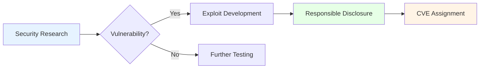
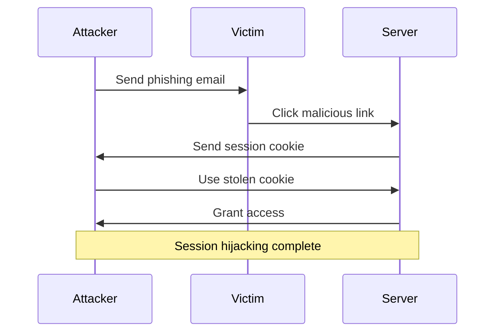
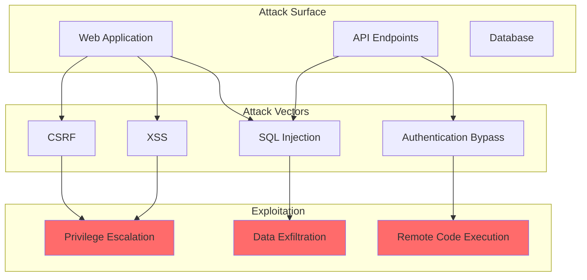

## Welcome to the Enhanced Blog!

This post demonstrates all the amazing frontend libraries integrated into your blog.

## 1. Mermaid Diagrams

Create beautiful diagrams with simple markdown:



## 2. Code Syntax Highlighting with Copy Button

Hover over the code block to see the **Copy** button:

```python
def exploit_buffer_overflow(target, payload):
    """
    Demonstrate a buffer overflow exploit
    """
    # Create shellcode
    shellcode = b"\x31\xc0\x50\x68\x2f\x2f\x73\x68"
    shellcode += b"\x68\x2f\x62\x69\x6e\x89\xe3\x50"

    # Calculate offset
    offset = 64

    # Build final payload
    final_payload = b"A" * offset
    final_payload += shellcode

    return final_payload

# Usage
target_ip = "192.168.1.100"
payload = exploit_buffer_overflow(target_ip, None)
print(f"Payload size: {len(payload)} bytes")
```

JavaScript example:

```javascript
// XSS payload generator
function generateXSSPayload(target) {
    const payloads = [
        '<script>alert(document.cookie)</script>',
        '',
        '<svg/onload=alert(1)>'
    ];

    return payloads.map(p =>
        encodeURIComponent(p)
    );
}

console.log(generateXSSPayload('example.com'));
```

Bash commands:

```bash
# Scan for open ports
nmap -sV -sC 192.168.1.0/24

# Extract files from pcap
tcpdump -r capture.pcap -w output.pcap

# Brute force SSH
hydra -l admin -P /usr/share/wordlists/rockyou.txt ssh://192.168.1.1
```

## 3. Math Formulas with KaTeX

Inline math: The RSA encryption formula is $c = m^e \mod n$

Display math:

$$
E(m) = m^e \mod n
$$

$$
D(c) = c^d \mod n
$$

Where:
- $m$ = plaintext message
- $c$ = ciphertext
- $e$ = public exponent
- $d$ = private exponent
- $n$ = modulus

## 4. Images with Click-to-Zoom

Click on any image in your posts to zoom in! (Demo with placeholder)


## 5. Tooltips

Hover over these <span data-tippy-content="Common Vulnerabilities and Exposures">CVE</span> or <span data-tippy-content="Cross-Site Scripting">XSS</span> terms to see tooltips!

Links with tooltips: [Visit OWASP](https://owasp.org) (external link indicator)

## 6. Sequence Diagram



## 7. Table of Contents

For posts with 500+ words, a table of contents automatically appears at the top!

## 8. Smooth Animations

All elements fade in smoothly as you scroll. Notice how each post item animates on the homepage!

## 9. Terminal Recordings (Asciinema)

You can embed terminal recordings (just add an asciinema-player div with a cast file):

```html
<div id="demo" class="asciinema-player-wrapper"></div>
<script>
  AsciinemaPlayer.create('/casts/demo.cast',
    document.getElementById('demo'),
    { theme: 'monokai' }
  );
</script>
```

## 10. Complex Diagram Example



## Summary

Your blog now has:

✅ **Mermaid** - Beautiful diagrams
✅ **Prism.js** - Syntax highlighting with line numbers
✅ **ClipboardJS** - Copy code buttons
✅ **Medium Zoom** - Click-to-zoom images
✅ **KaTeX** - Math formulas
✅ **Tocbot** - Auto table of contents
✅ **AOS** - Scroll animations
✅ **Tippy.js** - Tooltips
✅ **Fuse.js** - Search ready (needs implementation)
✅ **Asciinema** - Terminal recordings

Happy blogging! 🚀
