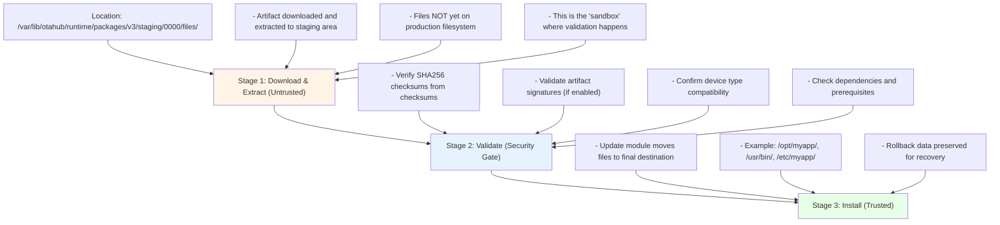
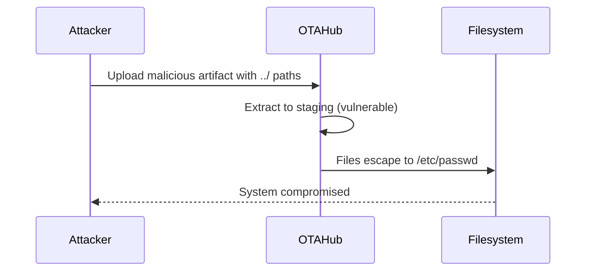
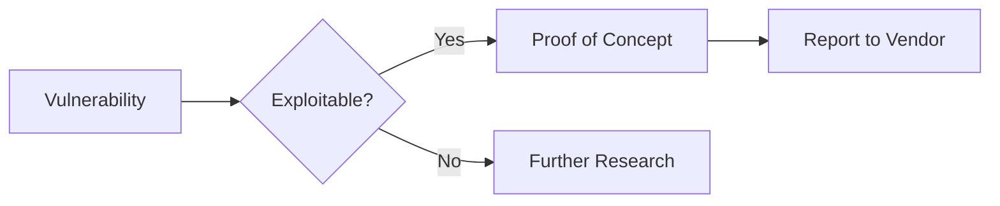

## Testing Mermaid Diagrams

This post demonstrates Mermaid diagram rendering.

### OTA Update Security Flow



### Attack Flow Example



### Simple Graph



## Code Example with Syntax Highlighting

Here's some Python code:

```python
def exploit_path_traversal(filename):
    # Create malicious path
    malicious_path = f"../../../../etc/{filename}"

    # This will escape the sandbox
    with open(malicious_path, 'w') as f:
        f.write("attacker controlled content")

    return malicious_path

# Usage
exploit_path_traversal("passwd")
```

And some bash:

```bash
# Extract malicious tar
tar -xzf malicious.tar.gz

# Check where files ended up
ls -la /etc/passwd
```
