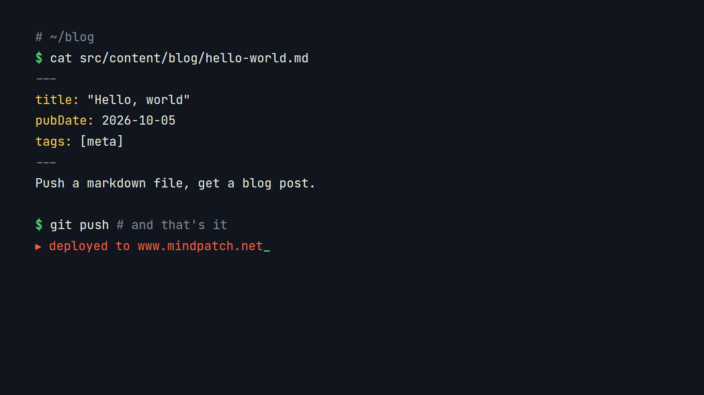

Welcome to the new blog on **mindpatch.net**. This is where I'll put write-ups on security research, bug hunting and anything else that doesn't fit in a tweet.

## How it works

Each post is a plain markdown file. Pushing it to the repo rebuilds the site, so writing a post looks like this:



*Click any image to zoom in.*

## What markdown gets you

- Headings, lists, **bold**, *italics* and [links](https://github.com/MindPatch)
- Tables, quotes and inline `code`
- Syntax-highlighted code blocks

```rust
fn main() {
    let target = "https://www.mindpatch.net";
    println!("scanning {target}...");
}
```

> Stay curious, report responsibly.

| Thing        | Status |
| ------------ | ------ |
| Markdown     | done   |
| Image zoom   | done   |
| RSS & sitemap| done   |
